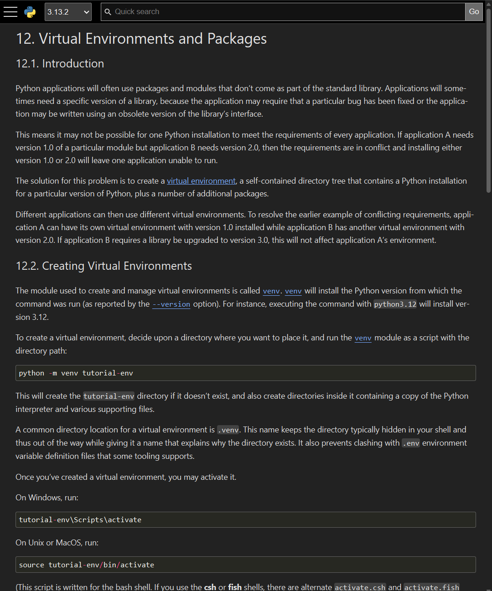

---
# You can also start simply with 'default'
theme: default
# background: https://cover.sli.dev
title: Virtual Environments
# apply unocss classes to the current slide
class: text-center
# slide transition: https://sli.dev/guide/animations.html#slide-transitions
transition: slide-left
# enable MDC Syntax: https://sli.dev/features/mdc
mdc: true
lineNumbers: true
---

# Virtual Environments

## _CCA Software Tutorial_

Lehman Garrison (SCC)

March 25, 2025

<div class="image-container">
  
  
</div>

<style>
  .image-container {
    display: flex;
    align-items: center;
    gap: 20px; /* space between images */
    margin: auto;
  }
  
  .image-container img {
    width: 30%;
    margin: auto;
  }
</style>

<!--
The last comment block of each slide will be treated as slide notes. It will be visible and editable in Presenter Mode along with the slide. [Read more in the docs](https://sli.dev/guide/syntax.html#notes)
-->

---

# Prologue: why do we need "environments"?

- Why can't I just `pip install` whatever I need?
  - Different packages have different dependencies
- Consider:
  - package A depends on `numpy < 2`,
  - package B depends on `numpy >= 2`.
  - Need different environment for each!
- Python only lets us have 1 version of a package associated with a name
- Once we have a working environment, we want to leave it alone

---
layout: two-cols
---

## Virtual Environments

- Also called "venvs"
- A package isolation mechanism ([PEP 405](https://peps.python.org/pep-0405/))
- `venv`: the built-in Python module to create virtual environments
- There's a whole ecosystem of virtual environment management tools:
  - `venv` (built-in)
  - `virtualenv` (1st party, but not built-in)
  - `conda` (does much more than venvs)
  - `pyenv`, `virtualenvwrapper`, etc

::right::

<div style="text-align: center;">

<a style="margin:auto;" href="https://docs.python.org/3/tutorial/venv.html">https://docs.python.org/3/tutorial/venv.html</a>
</div>
---

## The Zen of Python

```py
>>> import this
```

```{all|15|15,16|15,16,21}
The Zen of Python, by Tim Peters

Beautiful is better than ugly.
Explicit is better than implicit.
Simple is better than complex.
Complex is better than complicated.
Flat is better than nested.
Sparse is better than dense.
Readability counts.
Special cases aren't special enough to break the rules.
Although practicality beats purity.
Errors should never pass silently.
Unless explicitly silenced.
In the face of ambiguity, refuse the temptation to guess.
There should be one-- and preferably only one --obvious way to do it.
Although that way may not be obvious at first unless you're Dutch.
Now is better than never.
Although never is often better than *right* now.
If the implementation is hard to explain, it's a bad idea.
If the implementation is easy to explain, it may be a good idea.
Namespaces are one honking great idea -- let's do more of those!
```

---

## `venv`

- Let's focus on `venv`
  - Until very recently, that was how I created venvs (now I use `uv`)
  - Still a very good option since it's built-in, so it's available anywhere
  - Interface is very similar to `uv venv`
  - The way Python uses a venv is identical for all venv tools
  - (This talk is a not-so-secret warm-up for a future session on `uv`)
- If you want to follow along:
  - On the cluster: `module load python`
  - On your laptop: as long as `python` works, should be fine (conda, OS python, uv all fine)

---

## Setting up a venv

- First check what Python is being used:

```shell
which python
```

- Now set up a venv:

```shell
mkdir venv-tutorial
cd venv-tutorial
python -m venv .venv
source .venv/bin/activate
```

- For short, can replace `source` with `.`:

````md magic-move {lines: true}
```shell
source .venv/bin/activate
```

```shell
. .venv/bin/activate
```
````

- And check again which Python is being used:

```shell
which python
```

---

## Using a venv

- Check what packages are installed

```shell
pip list
```

- Install a package

```shell
pip install numpy
```

- Check that we can import it:

```python
>>> import numpy as np
>>> np.__file__
```

---

## Adding your active project to the venv

- What about the project that I'm actively editing?
- For very simple projects (i.e. a few `.py` files in a single dir), you might not need to "install" it into your venv
- For anything more complex should install it!
- What does "complex" mean?
  - src-layout (files in `src/MyPackage/*.py`)
  - Projects with relative imports (`from . import x`)
  - Want to use from a Jupyter notebook (no need to modify `sys.path`!)
- Usually do an "editable" install:

```shell
cd myproj
. .venv/bin/activate
pip install -e .
```

- Requires a `pyproject.toml` (`uv` can help with this, come back for the `uv` tutorial!)

---

## Select the venv in VS Code

- Make sure the venv is selected in your IDE! This makes everything ✨ Just Work ✨
- This will usually be automatic (especially if your venv is named `.venv`), but you might need to tell VS Code what venv you're using
- VS Code:
  - `F1` -> `Python: Select interpreter`
  - `.venv/bin/python`
- This ensures proper suggestions for tab-complete, type inference, etc.

---

## How to organize your environment

- I usually make a file called `env` and source it when I'm working on a certain project:

```shell
cd myproj
. ./env
```

- The file contains any environment setup/venv activation:

```shell
cat env
```

```
export NUMBA_THREADING_LAYER=forksafe
ml modules/2.3 python
. .venv/bin/activate
```

- If you're a cluster user, use the same `env` file in your Slurm scripts too:
```shell
#SBATCH -p cca
#SBATCH -C ib-genoa
#SBATCH -n 192

. ./env
srun python my_mpi_job.py
```

---

## Cheat Sheet: How to Use a Venv

- Create a venv:

```shell
cd myproj
python -m venv .venv
```

- Put the activation command (and any other setup) in an `env` file:

```shell
. .venv/bin/activate
```

- And when starting work on a project, activate the env with:

```shell
. ./env
```

- And now when you run `python`, all packages will come from the `venv`!
- With an active venv, install any packages:

```shell
pip install numpy
```

- To install your current project (the current directory) in editable mode:

```shell
pip install -e .
```

- Don't forget to tell your IDE about the venv! (VS Code: `Python: Select interpreter`)

---
layout: section
---

# But how does it work?

## And what can go wrong?

---

## How does the shell know about the venv?
- We activate a venv by sourcing the activation script: `. .venv/bin/activate`
- "Sourcing" a file runs it as if we typed all the lines in the current shell

```shell
cat .venv/bin/activate
```
```
...
PATH="$VIRTUAL_ENV/bin:$PATH"
export PATH
...
```

- Activating the venv just\* updates `PATH`!
  - \*`VIRTUAL_ENV` and a few other things also get set, but they don't affect package resolution
- That's how our shell knows to use the venv `python`
- Implication: can also run Python as `myproj/.venv/bin/python`, and Python will open in the venv, even though you didn't activate it!
  - This is how installed scripts in venvs work

---

## How does Python know about the venv?

- So now when we type `python`, it's the `python` in our venv.
- That `python` is actually a symlink:

```shell
ls -l .venv/bin/python
```

```
lrwxrwxrwx 1 lgarrison lgarrison 81 Mar 18 15:45 .venv/bin/python -> /mnt/sw/nix/store/71ksmx7k6xy3v9ksfkv5mp5kxxp64pd6-python-3.10.13-view/bin/python
```

- But wait, it's just a link to the old Python! So how does it know to use our venv packages??
- Any guesses?
  - It's not a special executable,
  - it's not reading any environment variables.

---

## How does Python know about the venv?

- It's the location of the symlink!
- Specifically, it looks for a "nearby" file called `pyvenv.cfg` (or `../pyvenv.cfg`)

```shell
cat .venv/pyvenv.cfg
```

```
home = /mnt/sw/nix/store/71ksmx7k6xy3v9ksfkv5mp5kxxp64pd6-python-3.10.13-view/bin
include-system-site-packages = false
version = 3.10.13
```

---

## How does `import` know about the venv?

- How does `import numpy` resolve to the numpy in our venv?
- Python searches `sys.path` (in order) for packages.
- Activating a venv just modifies `sys.path`!
- No venv:

````md magic-move
```shell
python -c 'import sys; print(sys.path)'
['', '/mnt/sw/nix/store/71ksmx7k6xy3v9ksfkv5mp5kxxp64pd6-python-3.10.13-view/lib/python310.zip', '/mnt/sw/nix/store/71ksmx7k6xy3v9ksfkv5mp5kxxp64pd6-python-3.10.13-view/lib/python3.10', '/mnt/sw/nix/store/71ksmx7k6xy3v9ksfkv5mp5kxxp64pd6-python-3.10.13-view/lib/python3.10/lib-dynload', '/mnt/sw/nix/store/71ksmx7k6xy3v9ksfkv5mp5kxxp64pd6-python-3.10.13-view/lib/python3.10/site-packages']
```

```shell
python -c 'import sys; print(sys.path)'
[..., '/mnt/sw/nix/store/71ksmx7k6xy3v9ksfkv5mp5kxxp64pd6-python-3.10.13-view/lib/python3.10/site-packages']
```
````

- With venv:

````md magic-move
```shell
python -c 'import sys; print(sys.path)'
['','/mnt/sw/nix/store/71ksmx7k6xy3v9ksfkv5mp5kxxp64pd6-python-3.10.13-view/lib/python310.zip', '/mnt/sw/nix/store/71ksmx7k6xy3v9ksfkv5mp5kxxp64pd6-python-3.10.13-view/lib/python3.10', '/mnt/sw/nix/store/71ksmx7k6xy3v9ksfkv5mp5kxxp64pd6-python-3.10.13-view/lib/python3.10/lib-dynload', '/mnt/home/lgarrison/cca_software_group/venv-tut/.venv/lib/python3.10/site-packages']
```

```shell
python -c 'import sys; print(sys.path)'
[..., '/mnt/home/lgarrison/cca_software_group/venv-tut/.venv/lib/python3.10/site-packages']
```
````

- When things go wrong, always a good idea to look at `sys.path`

---

## Speaking of things going wrong...

- What happens if you run `pip install` outside a venv?
  - Depending on your installation, you may get `pip install --user` by default
- `--user` installs go into user site packages, `~/.local/lib/python3.X/...`
- User site packages may not be consistent with your project!
- Can diagnose this with `package.__file__` and looking at `sys.path` and seeing that user site packages comes first

---

## `PYTHONPATH`

- This seems complicated... can't I just modify `PYTHONPATH`?
- `PYTHONPATH` just adds directories to `sys.path`
- In one sense, it's fine, because venvs also work by modifying `sys.path`
- But can lead to problems:
  - May work for the current shell, but won't work for other processes that don't inherit the shell's environment (e.g. JupyterHub)
  - Can't `pip install` into a `PYTHONPATH`, so may end up in a confusing situation where packages are successfully getting installed, but your interpreter isn't seeing them
  - Where to install non-editable dependencies? User site packages?

---
layout: section
---

# Cheat Sheet

---

## Cheat Sheet: How to Use a Venv
- Create a venv:
```shell
cd myproj
python -m venv .venv
```

- Put the activation command (and any other setup) in an `env` file:
```shell
. .venv/bin/activate
```

- And when starting work on a project, activate the env with:
```shell
. ./env
```

- And now when you run `python`, all packages will come from the `venv`!
- With an active venv, install any packages:
```shell
pip install numpy
```

- To install your current project (the current directory) in editable mode:
```shell
pip install -e .
```

- Don't forget to tell your IDE about the venv! (VS Code: `Python: Select interpreter`)
- If things go wrong, check `package.__file__` and `sys.path`

<!-- - `pyvenv.cfg`
- user packages and `PYTHONNOUSERSITE`
- `--system-site-packages`
- `python -I`
- `pip install -e` pth link
- PEP 668 externally managed
- for the cluster
  - order of `module load python` and `.venv/bin/activate`
  - do I need `ml python` once I've created the venv?
- is `.venv` special?
-->
