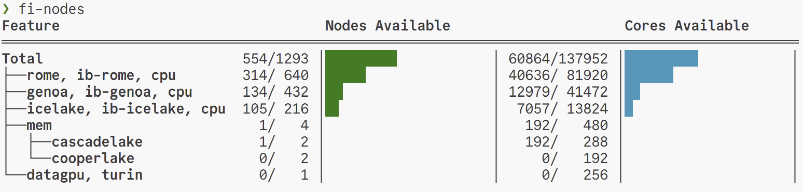
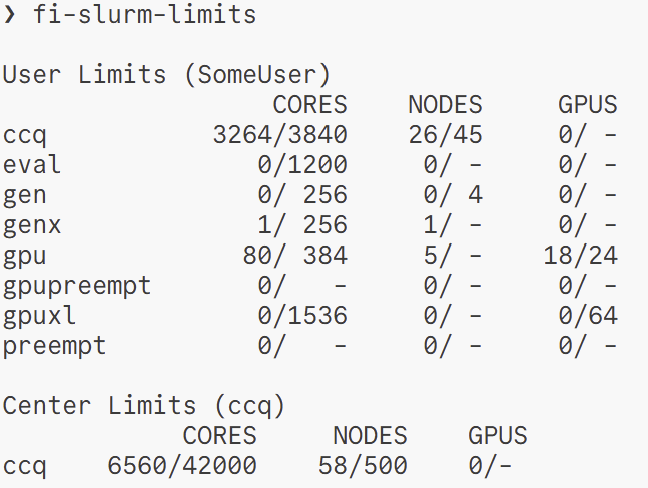

---
# You can also start simply with 'default'
theme: default
# background: https://cover.sli.dev
title: Rust-Based Slurm Monitoring CLI Utilities
# apply unocss classes to the current slide
class: text-center
# slide transition: https://sli.dev/guide/animations.html#slide-transitions
transition: slide-left
# enable MDC Syntax: https://sli.dev/features/mdc
mdc: true
lineNumbers: true
routerMode: hash
---

<style>
.katex {
  font-size: 1em; /* Adjust this value as needed */
}

.slidev-layout li {
  line-height: 1.4em; /* Adjust this value as needed */
}

.slidev-layout.cover h1 {
  font-size: 2.2em;
}
</style>

# Rust-Based Slurm Monitoring CLI Utilities
<div class="authors-container">
  <div>
    Lehman Garrison<br>
    <a href="https://github.com/lgarrison">github.com/lgarrison</a><br>
    Senior Software Engineer<br>
    Scientific Computing Core (SCC)<br>
    Flatiron Institute<br>
  </div>

  <div>
    Nico Posner<br>
    <a href="https://github.com/nrposner">github.com/nrposner</a><br>
    University of Chicago<br>
    SCC Intern, Summer 2025<br>
  </div>
</div>

<div>
SC25 Conference<br>
November 19, 2025<br>
</div>

<br>

<div class="bottom-container">
  <div class="github-container">
    <a href="https://github.com/flatironinstitute/fi-slurm-utils" class="github-link" aria-label="GitHub Profile">
      
      flatironinstitute/fi-slurm-utils
    </a>
  </div>

  <div class="image-container">
    
  </div>
</div>

<style>
  .authors-container {
    display: flex;
    justify-content: center;
    gap: 80px;
    margin: 20px 0;
  }

  .authors-container > div {
    flex: 0 1 auto;
  }

.bottom-container {
    display: flex;
    justify-content: center;
    align-items: center;
    gap: 50px;
    margin: 0 auto;
  }
  
  .image-container img {
    height: 50px;
  }

  .github-container {
    display: flex;
    align-items: center;
  }

  .github-link {
    display: flex;
    align-items: center;
    gap: 0px;
    text-decoration: none;
  }

  .github-icon {
    height: 40px;
    width: 40px;
    margin-right: 5px;
  }
</style>

---
layout: two-cols-header
---

# The Slurm Workload Manager

::left::

- Slurm is a workload manager for computer clusters
- It manages a queue of jobs and schedules work for execution on nodes
- "Jobs" are typically shell scripts that specify resource requests (number/type of nodes, number/type of GPUs, etc)
- A node is a separate computer, onto which jobs can be scheduled
- For each node, Slurm tracks:
  - Number of available CPUs
  - Amount of available memory
  - Number of available GPUs (if applicable)
- Jobs are scheduled onto nodes based on priority and resource availability

::right::

```bash
#!/bin/bash
#SBATCH --nodes 2
#SBATCH --ntasks-per-node=4
#SBATCH --cpus-per-task=16
#SBATCH --mem-per-cpu=8G
#SBATCH --contraint icelake

srun python myscript.py
```

<br>

<div style="text-align: center; font-size: smaller; width: 80%; margin: auto;">

<a href="https://slurm.schedmd.com">slurm.schedmd.com</a>
</div>

---
layout: two-cols-header
---

# Common Challenges with Slurm

<style>
  
.slidev-layout.two-cols-header .col-right {
  padding-left: 4rem !important;
}

pre {
  max-width: 550px;
}
</style>

::left::

- Confusing error messages
  - Why was my job submission rejected?
  - Why isn't my job running?
- Highly flexible configuration -- every site configures their cluster differently
  - How do I discover what kinds of CPUs/GPUs a cluster has?
  - How do I submit to different node types?
  - How do I see what kinds of nodes are available right now?

::right::

Invalid GPU constraint:

```console
❯ salloc --partition gpu --constraint v100 --gpus 1
salloc: error: Job submit/allocate failed: Invalid feature specification
```

Unavailable nodes:

```console
❯ squeue --me
JOBID PARTITION     NAME     USER ST       TIME  NODES NODELIST(REASON)
5618047      eval interact lgarriso PD       0:00      1 (ReqNodeNotAvail,UnavailableNodes:workergpu[170,225-226])
```

Wrong partition:

```console
❯ salloc --constraint h100 --gpus 1          
salloc: error: Job submit/allocate failed: Requested node configuration is not available
```

---

# Slurm: Finding Idle Nodes

```console {*}{maxHeight:'400px'}
❯ sinfo  
PARTITION  AVAIL  TIMELIMIT  NODES  STATE NODELIST
gen*          up 7-00:00:00      1  boot^ worker7060
gen*          up 7-00:00:00    140  drng@ worker[5007,5040-5041,5067-5068,5080,5099,5107-5108,5156-5157,5159-5161,5166,5175,5193,5198,5202-5203,5205-5206,5209,5213-5214,5218-5219,5223-5232,5286-5287,5293-5294,5327-5329,5356-5358,5431-5432,5435-5438,5498-5499,5526,5560,5605,6003-6005,6012-6013,6015,6019,6022,6040-6047,6093,6096,6108,6140,6145-6154,6160,6167-6168,6180,7020,7024,7026-7027,7033,7035,7053,7067,7070,7099,7104-7105,7108,7116-7118,7121,7137,7152-7154,7166,7176-7177,7180-7182,7198,7200,7204,7231,7244-7246,7248-7249,7314,7352,7354-7359,7388,7395-7396,7411]
gen*          up 7-00:00:00      9 drain* worker[5045,5106,5172,5295,5503,5558,6183-6184,7073]
gen*          up 7-00:00:00      3  drain worker[5309,6133-6134]
gen*          up 7-00:00:00      3   resv worker[5639-5640,6166]
gen*          up 7-00:00:00      7    mix worker[5001,5130,6011,6048,6098-6099,6171]
gen*          up 7-00:00:00   1019  alloc worker[5002-5006,5008-5039,5042-5044,5046-5066,5069-5079,5081-5098,5100-5105,5109-5129,5131-5155,5158,5162-5165,5167-5171,5173-5174,5176-5192,5194-5197,5199-5201,5204,5207-5208,5210-5212,5215-5217,5220-5222,5233-5285,5288-5292,5296-5308,5310-5326,5330-5355,5359-5363,5402-5430,5433-5434,5439-5466,5473-5493,5500-5502,5504-5511,5515-5521,5523-5525,5527-5536,5538-5552,5554-5557,5559,5561,5583-5604,5606-5616,5619-5620,6001-6002,6006-6010,6014,6016-6018,6020-6021,6023-6039,6049-6092,6094-6095,6097,6100-6107,6109-6132,6135-6139,6141-6144,6155-6159,6161-6165,6169-6170,6172-6179,6181-6182,6185-6216,7001-7010,7014-7019,7021-7023,7025,7028-7032,7034,7036-7052,7054-7059,7061-7066,7068-7069,7071-7072,7074-7098,7100-7103,7106-7107,7109-7115,7119-7120,7122-7136,7138-7151,7155-7165,7167-7168,7170-7175,7178-7179,7183-7197,7199,7201-7203,7205-7230,7232-7243,7247,7250-7304,7306-7313,7315-7351,7353,7360,7367-7387,7389-7394,7397-7410,7412-7432]
gen*          up 7-00:00:00    106   idle worker[5364-5401,5467-5472,5494-5497,5512-5514,5522,5537,5553,5562-5582,5617-5618,5621-5638,7011-7013,7169,7305,7361-7366]
genx          up 7-00:00:00      1  boot^ worker7060
genx          up 7-00:00:00    140  drng@ worker[5007,5040-5041,5067-5068,5080,5099,5107-5108,5156-5157,5159-5161,5166,5175,5193,5198,5202-5203,5205-5206,5209,5213-5214,5218-5219,5223-5232,5286-5287,5293-5294,5327-5329,5356-5358,5431-5432,5435-5438,5498-5499,5526,5560,5605,6003-6005,6012-6013,6015,6019,6022,6040-6047,6093,6096,6108,6140,6145-6154,6160,6167-6168,6180,7020,7024,7026-7027,7033,7035,7053,7067,7070,7099,7104-7105,7108,7116-7118,7121,7137,7152-7154,7166,7176-7177,7180-7182,7198,7200,7204,7231,7244-7246,7248-7249,7314,7352,7354-7359,7388,7395-7396,7411]
genx          up 7-00:00:00      9 drain* worker[5045,5106,5172,5295,5503,5558,6183-6184,7073]
genx          up 7-00:00:00      3  drain worker[5309,6133-6134]
genx          up 7-00:00:00      3   resv worker[5639-5640,6166]
genx          up 7-00:00:00      7    mix worker[5001,5130,6011,6048,6098-6099,6171]
genx          up 7-00:00:00   1019  alloc worker[5002-5006,5008-5039,5042-5044,5046-5066,5069-5079,5081-5098,5100-5105,5109-5129,5131-5155,5158,5162-5165,5167-5171,5173-5174,5176-5192,5194-5197,5199-5201,5204,5207-5208,5210-5212,5215-5217,5220-5222,5233-5285,5288-5292,5296-5308,5310-5326,5330-5355,5359-5363,5402-5430,5433-5434,5439-5466,5473-5493,5500-5502,5504-5511,5515-5521,5523-5525,5527-5536,5538-5552,5554-5557,5559,5561,5583-5604,5606-5616,5619-5620,6001-6002,6006-6010,6014,6016-6018,6020-6021,6023-6039,6049-6092,6094-6095,6097,6100-6107,6109-6132,6135-6139,6141-6144,6155-6159,6161-6165,6169-6170,6172-6179,6181-6182,6185-6216,7001-7010,7014-7019,7021-7023,7025,7028-7032,7034,7036-7052,7054-7059,7061-7066,7068-7069,7071-7072,7074-7098,7100-7103,7106-7107,7109-7115,7119-7120,7122-7136,7138-7151,7155-7165,7167-7168,7170-7175,7178-7179,7183-7197,7199,7201-7203,7205-7230,7232-7243,7247,7250-7304,7306-7313,7315-7351,7353,7360,7367-7387,7389-7394,7397-7410,7412-7432]
genx          up 7-00:00:00    106   idle worker[5364-5401,5467-5472,5494-5497,5512-5514,5522,5537,5553,5562-5582,5617-5618,5621-5638,7011-7013,7169,7305,7361-7366]
scc           up 7-00:00:00      1  boot^ worker7060
scc           up 7-00:00:00    140  drng@ worker[5007,5040-5041,5067-5068,5080,5099,5107-5108,5156-5157,5159-5161,5166,5175,5193,5198,5202-5203,5205-5206,5209,5213-5214,5218-5219,5223-5232,5286-5287,5293-5294,5327-5329,5356-5358,5431-5432,5435-5438,5498-5499,5526,5560,5605,6003-6005,6012-6013,6015,6019,6022,6040-6047,6093,6096,6108,6140,6145-6154,6160,6167-6168,6180,7020,7024,7026-7027,7033,7035,7053,7067,7070,7099,7104-7105,7108,7116-7118,7121,7137,7152-7154,7166,7176-7177,7180-7182,7198,7200,7204,7231,7244-7246,7248-7249,7314,7352,7354-7359,7388,7395-7396,7411]
scc           up 7-00:00:00      9 drain* worker[5045,5106,5172,5295,5503,5558,6183-6184,7073]
scc           up 7-00:00:00      3  drain worker[5309,6133-6134]
scc           up 7-00:00:00      3   resv worker[5639-5640,6166]
scc           up 7-00:00:00      7    mix worker[5001,5130,6011,6048,6098-6099,6171]
scc           up 7-00:00:00   1019  alloc worker[5002-5006,5008-5039,5042-5044,5046-5066,5069-5079,5081-5098,5100-5105,5109-5129,5131-5155,5158,5162-5165,5167-5171,5173-5174,5176-5192,5194-5197,5199-5201,5204,5207-5208,5210-5212,5215-5217,5220-5222,5233-5285,5288-5292,5296-5308,5310-5326,5330-5355,5359-5363,5402-5430,5433-5434,5439-5466,5473-5493,5500-5502,5504-5511,5515-5521,5523-5525,5527-5536,5538-5552,5554-5557,5559,5561,5583-5604,5606-5616,5619-5620,6001-6002,6006-6010,6014,6016-6018,6020-6021,6023-6039,6049-6092,6094-6095,6097,6100-6107,6109-6132,6135-6139,6141-6144,6155-6159,6161-6165,6169-6170,6172-6179,6181-6182,6185-6216,7001-7010,7014-7019,7021-7023,7025,7028-7032,7034,7036-7052,7054-7059,7061-7066,7068-7069,7071-7072,7074-7098,7100-7103,7106-7107,7109-7115,7119-7120,7122-7136,7138-7151,7155-7165,7167-7168,7170-7175,7178-7179,7183-7197,7199,7201-7203,7205-7230,7232-7243,7247,7250-7304,7306-7313,7315-7351,7353,7360,7367-7387,7389-7394,7397-7410,7412-7432]
scc           up 7-00:00:00    106   idle worker[5364-5401,5467-5472,5494-5497,5512-5514,5522,5537,5553,5562-5582,5617-5618,5621-5638,7011-7013,7169,7305,7361-7366]
cca           up 7-00:00:00      1  boot^ worker7060
cca           up 7-00:00:00    140  drng@ worker[5007,5040-5041,5067-5068,5080,5099,5107-5108,5156-5157,5159-5161,5166,5175,5193,5198,5202-5203,5205-5206,5209,5213-5214,5218-5219,5223-5232,5286-5287,5293-5294,5327-5329,5356-5358,5431-5432,5435-5438,5498-5499,5526,5560,5605,6003-6005,6012-6013,6015,6019,6022,6040-6047,6093,6096,6108,6140,6145-6154,6160,6167-6168,6180,7020,7024,7026-7027,7033,7035,7053,7067,7070,7099,7104-7105,7108,7116-7118,7121,7137,7152-7154,7166,7176-7177,7180-7182,7198,7200,7204,7231,7244-7246,7248-7249,7314,7352,7354-7359,7388,7395-7396,7411]
cca           up 7-00:00:00      9 drain* worker[5045,5106,5172,5295,5503,5558,6183-6184,7073]
cca           up 7-00:00:00      3  drain worker[5309,6133-6134]
cca           up 7-00:00:00      3   resv worker[5639-5640,6166]
cca           up 7-00:00:00      7    mix worker[5001,5130,6011,6048,6098-6099,6171]
cca           up 7-00:00:00   1019  alloc worker[5002-5006,5008-5039,5042-5044,5046-5066,5069-5079,5081-5098,5100-5105,5109-5129,5131-5155,5158,5162-5165,5167-5171,5173-5174,5176-5192,5194-5197,5199-5201,5204,5207-5208,5210-5212,5215-5217,5220-5222,5233-5285,5288-5292,5296-5308,5310-5326,5330-5355,5359-5363,5402-5430,5433-5434,5439-5466,5473-5493,5500-5502,5504-5511,5515-5521,5523-5525,5527-5536,5538-5552,5554-5557,5559,5561,5583-5604,5606-5616,5619-5620,6001-6002,6006-6010,6014,6016-6018,6020-6021,6023-6039,6049-6092,6094-6095,6097,6100-6107,6109-6132,6135-6139,6141-6144,6155-6159,6161-6165,6169-6170,6172-6179,6181-6182,6185-6216,7001-7010,7014-7019,7021-7023,7025,7028-7032,7034,7036-7052,7054-7059,7061-7066,7068-7069,7071-7072,7074-7098,7100-7103,7106-7107,7109-7115,7119-7120,7122-7136,7138-7151,7155-7165,7167-7168,7170-7175,7178-7179,7183-7197,7199,7201-7203,7205-7230,7232-7243,7247,7250-7304,7306-7313,7315-7351,7353,7360,7367-7387,7389-7394,7397-7410,7412-7432]
cca           up 7-00:00:00    106   idle worker[5364-5401,5467-5472,5494-5497,5512-5514,5522,5537,5553,5562-5582,5617-5618,5621-5638,7011-7013,7169,7305,7361-7366]
ccb           up 7-00:00:00      1  boot^ worker7060
ccb           up 7-00:00:00    140  drng@ worker[5007,5040-5041,5067-5068,5080,5099,5107-5108,5156-5157,5159-5161,5166,5175,5193,5198,5202-5203,5205-5206,5209,5213-5214,5218-5219,5223-5232,5286-5287,5293-5294,5327-5329,5356-5358,5431-5432,5435-5438,5498-5499,5526,5560,5605,6003-6005,6012-6013,6015,6019,6022,6040-6047,6093,6096,6108,6140,6145-6154,6160,6167-6168,6180,7020,7024,7026-7027,7033,7035,7053,7067,7070,7099,7104-7105,7108,7116-7118,7121,7137,7152-7154,7166,7176-7177,7180-7182,7198,7200,7204,7231,7244-7246,7248-7249,7314,7352,7354-7359,7388,7395-7396,7411]
ccb           up 7-00:00:00      9 drain* worker[5045,5106,5172,5295,5503,5558,6183-6184,7073]
ccb           up 7-00:00:00      3  drain worker[5309,6133-6134]
ccb           up 7-00:00:00      3   resv worker[5639-5640,6166]
ccb           up 7-00:00:00      7    mix worker[5001,5130,6011,6048,6098-6099,6171]
ccb           up 7-00:00:00   1019  alloc worker[5002-5006,5008-5039,5042-5044,5046-5066,5069-5079,5081-5098,5100-5105,5109-5129,5131-5155,5158,5162-5165,5167-5171,5173-5174,5176-5192,5194-5197,5199-5201,5204,5207-5208,5210-5212,5215-5217,5220-5222,5233-5285,5288-5292,5296-5308,5310-5326,5330-5355,5359-5363,5402-5430,5433-5434,5439-5466,5473-5493,5500-5502,5504-5511,5515-5521,5523-5525,5527-5536,5538-5552,5554-5557,5559,5561,5583-5604,5606-5616,5619-5620,6001-6002,6006-6010,6014,6016-6018,6020-6021,6023-6039,6049-6092,6094-6095,6097,6100-6107,6109-6132,6135-6139,6141-6144,6155-6159,6161-6165,6169-6170,6172-6179,6181-6182,6185-6216,7001-7010,7014-7019,7021-7023,7025,7028-7032,7034,7036-7052,7054-7059,7061-7066,7068-7069,7071-7072,7074-7098,7100-7103,7106-7107,7109-7115,7119-7120,7122-7136,7138-7151,7155-7165,7167-7168,7170-7175,7178-7179,7183-7197,7199,7201-7203,7205-7230,7232-7243,7247,7250-7304,7306-7313,7315-7351,7353,7360,7367-7387,7389-7394,7397-7410,7412-7432]
ccb           up 7-00:00:00    106   idle worker[5364-5401,5467-5472,5494-5497,5512-5514,5522,5537,5553,5562-5582,5617-5618,5621-5638,7011-7013,7169,7305,7361-7366]
ccm           up 7-00:00:00      1  boot^ worker7060
ccm           up 7-00:00:00    140  drng@ worker[5007,5040-5041,5067-5068,5080,5099,5107-5108,5156-5157,5159-5161,5166,5175,5193,5198,5202-5203,5205-5206,5209,5213-5214,5218-5219,5223-5232,5286-5287,5293-5294,5327-5329,5356-5358,5431-5432,5435-5438,5498-5499,5526,5560,5605,6003-6005,6012-6013,6015,6019,6022,6040-6047,6093,6096,6108,6140,6145-6154,6160,6167-6168,6180,7020,7024,7026-7027,7033,7035,7053,7067,7070,7099,7104-7105,7108,7116-7118,7121,7137,7152-7154,7166,7176-7177,7180-7182,7198,7200,7204,7231,7244-7246,7248-7249,7314,7352,7354-7359,7388,7395-7396,7411]
ccm           up 7-00:00:00      9 drain* worker[5045,5106,5172,5295,5503,5558,6183-6184,7073]
ccm           up 7-00:00:00      3  drain worker[5309,6133-6134]
ccm           up 7-00:00:00      3   resv worker[5639-5640,6166]
ccm           up 7-00:00:00      7    mix worker[5001,5130,6011,6048,6098-6099,6171]
ccm           up 7-00:00:00   1019  alloc worker[5002-5006,5008-5039,5042-5044,5046-5066,5069-5079,5081-5098,5100-5105,5109-5129,5131-5155,5158,5162-5165,5167-5171,5173-5174,5176-5192,5194-5197,5199-5201,5204,5207-5208,5210-5212,5215-5217,5220-5222,5233-5285,5288-5292,5296-5308,5310-5326,5330-5355,5359-5363,5402-5430,5433-5434,5439-5466,5473-5493,5500-5502,5504-5511,5515-5521,5523-5525,5527-5536,5538-5552,5554-5557,5559,5561,5583-5604,5606-5616,5619-5620,6001-6002,6006-6010,6014,6016-6018,6020-6021,6023-6039,6049-6092,6094-6095,6097,6100-6107,6109-6132,6135-6139,6141-6144,6155-6159,6161-6165,6169-6170,6172-6179,6181-6182,6185-6216,7001-7010,7014-7019,7021-7023,7025,7028-7032,7034,7036-7052,7054-7059,7061-7066,7068-7069,7071-7072,7074-7098,7100-7103,7106-7107,7109-7115,7119-7120,7122-7136,7138-7151,7155-7165,7167-7168,7170-7175,7178-7179,7183-7197,7199,7201-7203,7205-7230,7232-7243,7247,7250-7304,7306-7313,7315-7351,7353,7360,7367-7387,7389-7394,7397-7410,7412-7432]
ccm           up 7-00:00:00    106   idle worker[5364-5401,5467-5472,5494-5497,5512-5514,5522,5537,5553,5562-5582,5617-5618,5621-5638,7011-7013,7169,7305,7361-7366]
ccn           up 7-00:00:00      1  boot^ worker7060
ccn           up 7-00:00:00    140  drng@ worker[5007,5040-5041,5067-5068,5080,5099,5107-5108,5156-5157,5159-5161,5166,5175,5193,5198,5202-5203,5205-5206,5209,5213-5214,5218-5219,5223-5232,5286-5287,5293-5294,5327-5329,5356-5358,5431-5432,5435-5438,5498-5499,5526,5560,5605,6003-6005,6012-6013,6015,6019,6022,6040-6047,6093,6096,6108,6140,6145-6154,6160,6167-6168,6180,7020,7024,7026-7027,7033,7035,7053,7067,7070,7099,7104-7105,7108,7116-7118,7121,7137,7152-7154,7166,7176-7177,7180-7182,7198,7200,7204,7231,7244-7246,7248-7249,7314,7352,7354-7359,7388,7395-7396,7411]
ccn           up 7-00:00:00      9 drain* worker[5045,5106,5172,5295,5503,5558,6183-6184,7073]
ccn           up 7-00:00:00      3  drain worker[5309,6133-6134]
ccn           up 7-00:00:00      3   resv worker[5639-5640,6166]
ccn           up 7-00:00:00      7    mix worker[5001,5130,6011,6048,6098-6099,6171]
ccn           up 7-00:00:00   1019  alloc worker[5002-5006,5008-5039,5042-5044,5046-5066,5069-5079,5081-5098,5100-5105,5109-5129,5131-5155,5158,5162-5165,5167-5171,5173-5174,5176-5192,5194-5197,5199-5201,5204,5207-5208,5210-5212,5215-5217,5220-5222,5233-5285,5288-5292,5296-5308,5310-5326,5330-5355,5359-5363,5402-5430,5433-5434,5439-5466,5473-5493,5500-5502,5504-5511,5515-5521,5523-5525,5527-5536,5538-5552,5554-5557,5559,5561,5583-5604,5606-5616,5619-5620,6001-6002,6006-6010,6014,6016-6018,6020-6021,6023-6039,6049-6092,6094-6095,6097,6100-6107,6109-6132,6135-6139,6141-6144,6155-6159,6161-6165,6169-6170,6172-6179,6181-6182,6185-6216,7001-7010,7014-7019,7021-7023,7025,7028-7032,7034,7036-7052,7054-7059,7061-7066,7068-7069,7071-7072,7074-7098,7100-7103,7106-7107,7109-7115,7119-7120,7122-7136,7138-7151,7155-7165,7167-7168,7170-7175,7178-7179,7183-7197,7199,7201-7203,7205-7230,7232-7243,7247,7250-7304,7306-7313,7315-7351,7353,7360,7367-7387,7389-7394,7397-7410,7412-7432]
ccn           up 7-00:00:00    106   idle worker[5364-5401,5467-5472,5494-5497,5512-5514,5522,5537,5553,5562-5582,5617-5618,5621-5638,7011-7013,7169,7305,7361-7366]
ccq           up 7-00:00:00      1  boot^ worker7060
ccq           up 7-00:00:00    140  drng@ worker[5007,5040-5041,5067-5068,5080,5099,5107-5108,5156-5157,5159-5161,5166,5175,5193,5198,5202-5203,5205-5206,5209,5213-5214,5218-5219,5223-5232,5286-5287,5293-5294,5327-5329,5356-5358,5431-5432,5435-5438,5498-5499,5526,5560,5605,6003-6005,6012-6013,6015,6019,6022,6040-6047,6093,6096,6108,6140,6145-6154,6160,6167-6168,6180,7020,7024,7026-7027,7033,7035,7053,7067,7070,7099,7104-7105,7108,7116-7118,7121,7137,7152-7154,7166,7176-7177,7180-7182,7198,7200,7204,7231,7244-7246,7248-7249,7314,7352,7354-7359,7388,7395-7396,7411]
ccq           up 7-00:00:00      9 drain* worker[5045,5106,5172,5295,5503,5558,6183-6184,7073]
ccq           up 7-00:00:00      3  drain worker[5309,6133-6134]
ccq           up 7-00:00:00      3   resv worker[5639-5640,6166]
ccq           up 7-00:00:00      7    mix worker[5001,5130,6011,6048,6098-6099,6171]
ccq           up 7-00:00:00   1019  alloc worker[5002-5006,5008-5039,5042-5044,5046-5066,5069-5079,5081-5098,5100-5105,5109-5129,5131-5155,5158,5162-5165,5167-5171,5173-5174,5176-5192,5194-5197,5199-5201,5204,5207-5208,5210-5212,5215-5217,5220-5222,5233-5285,5288-5292,5296-5308,5310-5326,5330-5355,5359-5363,5402-5430,5433-5434,5439-5466,5473-5493,5500-5502,5504-5511,5515-5521,5523-5525,5527-5536,5538-5552,5554-5557,5559,5561,5583-5604,5606-5616,5619-5620,6001-6002,6006-6010,6014,6016-6018,6020-6021,6023-6039,6049-6092,6094-6095,6097,6100-6107,6109-6132,6135-6139,6141-6144,6155-6159,6161-6165,6169-6170,6172-6179,6181-6182,6185-6216,7001-7010,7014-7019,7021-7023,7025,7028-7032,7034,7036-7052,7054-7059,7061-7066,7068-7069,7071-7072,7074-7098,7100-7103,7106-7107,7109-7115,7119-7120,7122-7136,7138-7151,7155-7165,7167-7168,7170-7175,7178-7179,7183-7197,7199,7201-7203,7205-7230,7232-7243,7247,7250-7304,7306-7313,7315-7351,7353,7360,7367-7387,7389-7394,7397-7410,7412-7432]
ccq           up 7-00:00:00    106   idle worker[5364-5401,5467-5472,5494-5497,5512-5514,5522,5537,5553,5562-5582,5617-5618,5621-5638,7011-7013,7169,7305,7361-7366]
icc           up 7-00:00:00      1  boot^ worker7060
icc           up 7-00:00:00    140  drng@ worker[5007,5040-5041,5067-5068,5080,5099,5107-5108,5156-5157,5159-5161,5166,5175,5193,5198,5202-5203,5205-5206,5209,5213-5214,5218-5219,5223-5232,5286-5287,5293-5294,5327-5329,5356-5358,5431-5432,5435-5438,5498-5499,5526,5560,5605,6003-6005,6012-6013,6015,6019,6022,6040-6047,6093,6096,6108,6140,6145-6154,6160,6167-6168,6180,7020,7024,7026-7027,7033,7035,7053,7067,7070,7099,7104-7105,7108,7116-7118,7121,7137,7152-7154,7166,7176-7177,7180-7182,7198,7200,7204,7231,7244-7246,7248-7249,7314,7352,7354-7359,7388,7395-7396,7411]
icc           up 7-00:00:00      9 drain* worker[5045,5106,5172,5295,5503,5558,6183-6184,7073]
icc           up 7-00:00:00      3  drain worker[5309,6133-6134]
icc           up 7-00:00:00      3   resv worker[5639-5640,6166]
icc           up 7-00:00:00      7    mix worker[5001,5130,6011,6048,6098-6099,6171]
icc           up 7-00:00:00   1019  alloc worker[5002-5006,5008-5039,5042-5044,5046-5066,5069-5079,5081-5098,5100-5105,5109-5129,5131-5155,5158,5162-5165,5167-5171,5173-5174,5176-5192,5194-5197,5199-5201,5204,5207-5208,5210-5212,5215-5217,5220-5222,5233-5285,5288-5292,5296-5308,5310-5326,5330-5355,5359-5363,5402-5430,5433-5434,5439-5466,5473-5493,5500-5502,5504-5511,5515-5521,5523-5525,5527-5536,5538-5552,5554-5557,5559,5561,5583-5604,5606-5616,5619-5620,6001-6002,6006-6010,6014,6016-6018,6020-6021,6023-6039,6049-6092,6094-6095,6097,6100-6107,6109-6132,6135-6139,6141-6144,6155-6159,6161-6165,6169-6170,6172-6179,6181-6182,6185-6216,7001-7010,7014-7019,7021-7023,7025,7028-7032,7034,7036-7052,7054-7059,7061-7066,7068-7069,7071-7072,7074-7098,7100-7103,7106-7107,7109-7115,7119-7120,7122-7136,7138-7151,7155-7165,7167-7168,7170-7175,7178-7179,7183-7197,7199,7201-7203,7205-7230,7232-7243,7247,7250-7304,7306-7313,7315-7351,7353,7360,7367-7387,7389-7394,7397-7410,7412-7432]
icc           up 7-00:00:00    106   idle worker[5364-5401,5467-5472,5494-5497,5512-5514,5522,5537,5553,5562-5582,5617-5618,5621-5638,7011-7013,7169,7305,7361-7366]
cmbas         up 7-00:00:00      1  boot^ worker7060
cmbas         up 7-00:00:00    140  drng@ worker[5007,5040-5041,5067-5068,5080,5099,5107-5108,5156-5157,5159-5161,5166,5175,5193,5198,5202-5203,5205-5206,5209,5213-5214,5218-5219,5223-5232,5286-5287,5293-5294,5327-5329,5356-5358,5431-5432,5435-5438,5498-5499,5526,5560,5605,6003-6005,6012-6013,6015,6019,6022,6040-6047,6093,6096,6108,6140,6145-6154,6160,6167-6168,6180,7020,7024,7026-7027,7033,7035,7053,7067,7070,7099,7104-7105,7108,7116-7118,7121,7137,7152-7154,7166,7176-7177,7180-7182,7198,7200,7204,7231,7244-7246,7248-7249,7314,7352,7354-7359,7388,7395-7396,7411]
cmbas         up 7-00:00:00      9 drain* worker[5045,5106,5172,5295,5503,5558,6183-6184,7073]
cmbas         up 7-00:00:00      3  drain worker[5309,6133-6134]
cmbas         up 7-00:00:00      3   resv worker[5639-5640,6166]
cmbas         up 7-00:00:00      7    mix worker[5001,5130,6011,6048,6098-6099,6171]
cmbas         up 7-00:00:00   1019  alloc worker[5002-5006,5008-5039,5042-5044,5046-5066,5069-5079,5081-5098,5100-5105,5109-5129,5131-5155,5158,5162-5165,5167-5171,5173-5174,5176-5192,5194-5197,5199-5201,5204,5207-5208,5210-5212,5215-5217,5220-5222,5233-5285,5288-5292,5296-5308,5310-5326,5330-5355,5359-5363,5402-5430,5433-5434,5439-5466,5473-5493,5500-5502,5504-5511,5515-5521,5523-5525,5527-5536,5538-5552,5554-5557,5559,5561,5583-5604,5606-5616,5619-5620,6001-6002,6006-6010,6014,6016-6018,6020-6021,6023-6039,6049-6092,6094-6095,6097,6100-6107,6109-6132,6135-6139,6141-6144,6155-6159,6161-6165,6169-6170,6172-6179,6181-6182,6185-6216,7001-7010,7014-7019,7021-7023,7025,7028-7032,7034,7036-7052,7054-7059,7061-7066,7068-7069,7071-7072,7074-7098,7100-7103,7106-7107,7109-7115,7119-7120,7122-7136,7138-7151,7155-7165,7167-7168,7170-7175,7178-7179,7183-7197,7199,7201-7203,7205-7230,7232-7243,7247,7250-7304,7306-7313,7315-7351,7353,7360,7367-7387,7389-7394,7397-7410,7412-7432]
cmbas         up 7-00:00:00    106   idle worker[5364-5401,5467-5472,5494-5497,5512-5514,5522,5537,5553,5562-5582,5617-5618,5621-5638,7011-7013,7169,7305,7361-7366]
polymathic    up 7-00:00:00      1  boot^ worker7060
polymathic    up 7-00:00:00    140  drng@ worker[5007,5040-5041,5067-5068,5080,5099,5107-5108,5156-5157,5159-5161,5166,5175,5193,5198,5202-5203,5205-5206,5209,5213-5214,5218-5219,5223-5232,5286-5287,5293-5294,5327-5329,5356-5358,5431-5432,5435-5438,5498-5499,5526,5560,5605,6003-6005,6012-6013,6015,6019,6022,6040-6047,6093,6096,6108,6140,6145-6154,6160,6167-6168,6180,7020,7024,7026-7027,7033,7035,7053,7067,7070,7099,7104-7105,7108,7116-7118,7121,7137,7152-7154,7166,7176-7177,7180-7182,7198,7200,7204,7231,7244-7246,7248-7249,7314,7352,7354-7359,7388,7395-7396,7411]
polymathic    up 7-00:00:00      9 drain* worker[5045,5106,5172,5295,5503,5558,6183-6184,7073]
polymathic    up 7-00:00:00      3  drain worker[5309,6133-6134]
polymathic    up 7-00:00:00      3   resv worker[5639-5640,6166]
polymathic    up 7-00:00:00      7    mix worker[5001,5130,6011,6048,6098-6099,6171]
polymathic    up 7-00:00:00   1019  alloc worker[5002-5006,5008-5039,5042-5044,5046-5066,5069-5079,5081-5098,5100-5105,5109-5129,5131-5155,5158,5162-5165,5167-5171,5173-5174,5176-5192,5194-5197,5199-5201,5204,5207-5208,5210-5212,5215-5217,5220-5222,5233-5285,5288-5292,5296-5308,5310-5326,5330-5355,5359-5363,5402-5430,5433-5434,5439-5466,5473-5493,5500-5502,5504-5511,5515-5521,5523-5525,5527-5536,5538-5552,5554-5557,5559,5561,5583-5604,5606-5616,5619-5620,6001-6002,6006-6010,6014,6016-6018,6020-6021,6023-6039,6049-6092,6094-6095,6097,6100-6107,6109-6132,6135-6139,6141-6144,6155-6159,6161-6165,6169-6170,6172-6179,6181-6182,6185-6216,7001-7010,7014-7019,7021-7023,7025,7028-7032,7034,7036-7052,7054-7059,7061-7066,7068-7069,7071-7072,7074-7098,7100-7103,7106-7107,7109-7115,7119-7120,7122-7136,7138-7151,7155-7165,7167-7168,7170-7175,7178-7179,7183-7197,7199,7201-7203,7205-7230,7232-7243,7247,7250-7304,7306-7313,7315-7351,7353,7360,7367-7387,7389-7394,7397-7410,7412-7432]
polymathic    up 7-00:00:00    106   idle worker[5364-5401,5467-5472,5494-5497,5512-5514,5522,5537,5553,5562-5582,5617-5618,5621-5638,7011-7013,7169,7305,7361-7366]
info          up 7-00:00:00      1  boot^ worker7060
info          up 7-00:00:00    140  drng@ worker[5007,5040-5041,5067-5068,5080,5099,5107-5108,5156-5157,5159-5161,5166,5175,5193,5198,5202-5203,5205-5206,5209,5213-5214,5218-5219,5223-5232,5286-5287,5293-5294,5327-5329,5356-5358,5431-5432,5435-5438,5498-5499,5526,5560,5605,6003-6005,6012-6013,6015,6019,6022,6040-6047,6093,6096,6108,6140,6145-6154,6160,6167-6168,6180,7020,7024,7026-7027,7033,7035,7053,7067,7070,7099,7104-7105,7108,7116-7118,7121,7137,7152-7154,7166,7176-7177,7180-7182,7198,7200,7204,7231,7244-7246,7248-7249,7314,7352,7354-7359,7388,7395-7396,7411]
info          up 7-00:00:00      9 drain* worker[5045,5106,5172,5295,5503,5558,6183-6184,7073]
info          up 7-00:00:00      3  drain worker[5309,6133-6134]
info          up 7-00:00:00      3   resv worker[5639-5640,6166]
info          up 7-00:00:00      7    mix worker[5001,5130,6011,6048,6098-6099,6171]
info          up 7-00:00:00   1019  alloc worker[5002-5006,5008-5039,5042-5044,5046-5066,5069-5079,5081-5098,5100-5105,5109-5129,5131-5155,5158,5162-5165,5167-5171,5173-5174,5176-5192,5194-5197,5199-5201,5204,5207-5208,5210-5212,5215-5217,5220-5222,5233-5285,5288-5292,5296-5308,5310-5326,5330-5355,5359-5363,5402-5430,5433-5434,5439-5466,5473-5493,5500-5502,5504-5511,5515-5521,5523-5525,5527-5536,5538-5552,5554-5557,5559,5561,5583-5604,5606-5616,5619-5620,6001-6002,6006-6010,6014,6016-6018,6020-6021,6023-6039,6049-6092,6094-6095,6097,6100-6107,6109-6132,6135-6139,6141-6144,6155-6159,6161-6165,6169-6170,6172-6179,6181-6182,6185-6216,7001-7010,7014-7019,7021-7023,7025,7028-7032,7034,7036-7052,7054-7059,7061-7066,7068-7069,7071-7072,7074-7098,7100-7103,7106-7107,7109-7115,7119-7120,7122-7136,7138-7151,7155-7165,7167-7168,7170-7175,7178-7179,7183-7197,7199,7201-7203,7205-7230,7232-7243,7247,7250-7304,7306-7313,7315-7351,7353,7360,7367-7387,7389-7394,7397-7410,7412-7432]
info          up 7-00:00:00    106   idle worker[5364-5401,5467-5472,5494-5497,5512-5514,5522,5537,5553,5562-5582,5617-5618,5621-5638,7011-7013,7169,7305,7361-7366]
other         up 7-00:00:00      1  boot^ worker7060
other         up 7-00:00:00    140  drng@ worker[5007,5040-5041,5067-5068,5080,5099,5107-5108,5156-5157,5159-5161,5166,5175,5193,5198,5202-5203,5205-5206,5209,5213-5214,5218-5219,5223-5232,5286-5287,5293-5294,5327-5329,5356-5358,5431-5432,5435-5438,5498-5499,5526,5560,5605,6003-6005,6012-6013,6015,6019,6022,6040-6047,6093,6096,6108,6140,6145-6154,6160,6167-6168,6180,7020,7024,7026-7027,7033,7035,7053,7067,7070,7099,7104-7105,7108,7116-7118,7121,7137,7152-7154,7166,7176-7177,7180-7182,7198,7200,7204,7231,7244-7246,7248-7249,7314,7352,7354-7359,7388,7395-7396,7411]
other         up 7-00:00:00      9 drain* worker[5045,5106,5172,5295,5503,5558,6183-6184,7073]
other         up 7-00:00:00      3  drain worker[5309,6133-6134]
other         up 7-00:00:00      3   resv worker[5639-5640,6166]
other         up 7-00:00:00      7    mix worker[5001,5130,6011,6048,6098-6099,6171]
other         up 7-00:00:00   1019  alloc worker[5002-5006,5008-5039,5042-5044,5046-5066,5069-5079,5081-5098,5100-5105,5109-5129,5131-5155,5158,5162-5165,5167-5171,5173-5174,5176-5192,5194-5197,5199-5201,5204,5207-5208,5210-5212,5215-5217,5220-5222,5233-5285,5288-5292,5296-5308,5310-5326,5330-5355,5359-5363,5402-5430,5433-5434,5439-5466,5473-5493,5500-5502,5504-5511,5515-5521,5523-5525,5527-5536,5538-5552,5554-5557,5559,5561,5583-5604,5606-5616,5619-5620,6001-6002,6006-6010,6014,6016-6018,6020-6021,6023-6039,6049-6092,6094-6095,6097,6100-6107,6109-6132,6135-6139,6141-6144,6155-6159,6161-6165,6169-6170,6172-6179,6181-6182,6185-6216,7001-7010,7014-7019,7021-7023,7025,7028-7032,7034,7036-7052,7054-7059,7061-7066,7068-7069,7071-7072,7074-7098,7100-7103,7106-7107,7109-7115,7119-7120,7122-7136,7138-7151,7155-7165,7167-7168,7170-7175,7178-7179,7183-7197,7199,7201-7203,7205-7230,7232-7243,7247,7250-7304,7306-7313,7315-7351,7353,7360,7367-7387,7389-7394,7397-7410,7412-7432]
other         up 7-00:00:00    106   idle worker[5364-5401,5467-5472,5494-5497,5512-5514,5522,5537,5553,5562-5582,5617-5618,5621-5638,7011-7013,7169,7305,7361-7366]
preempt       up 7-00:00:00      1  boot^ worker7060
preempt       up 7-00:00:00    140  drng@ worker[5007,5040-5041,5067-5068,5080,5099,5107-5108,5156-5157,5159-5161,5166,5175,5193,5198,5202-5203,5205-5206,5209,5213-5214,5218-5219,5223-5232,5286-5287,5293-5294,5327-5329,5356-5358,5431-5432,5435-5438,5498-5499,5526,5560,5605,6003-6005,6012-6013,6015,6019,6022,6040-6047,6093,6096,6108,6140,6145-6154,6160,6167-6168,6180,7020,7024,7026-7027,7033,7035,7053,7067,7070,7099,7104-7105,7108,7116-7118,7121,7137,7152-7154,7166,7176-7177,7180-7182,7198,7200,7204,7231,7244-7246,7248-7249,7314,7352,7354-7359,7388,7395-7396,7411]
preempt       up 7-00:00:00      9 drain* worker[5045,5106,5172,5295,5503,5558,6183-6184,7073]
preempt       up 7-00:00:00      3  drain worker[5309,6133-6134]
preempt       up 7-00:00:00      3   resv worker[5639-5640,6166]
preempt       up 7-00:00:00      7    mix worker[5001,5130,6011,6048,6098-6099,6171]
preempt       up 7-00:00:00   1019  alloc worker[5002-5006,5008-5039,5042-5044,5046-5066,5069-5079,5081-5098,5100-5105,5109-5129,5131-5155,5158,5162-5165,5167-5171,5173-5174,5176-5192,5194-5197,5199-5201,5204,5207-5208,5210-5212,5215-5217,5220-5222,5233-5285,5288-5292,5296-5308,5310-5326,5330-5355,5359-5363,5402-5430,5433-5434,5439-5466,5473-5493,5500-5502,5504-5511,5515-5521,5523-5525,5527-5536,5538-5552,5554-5557,5559,5561,5583-5604,5606-5616,5619-5620,6001-6002,6006-6010,6014,6016-6018,6020-6021,6023-6039,6049-6092,6094-6095,6097,6100-6107,6109-6132,6135-6139,6141-6144,6155-6159,6161-6165,6169-6170,6172-6179,6181-6182,6185-6216,7001-7010,7014-7019,7021-7023,7025,7028-7032,7034,7036-7052,7054-7059,7061-7066,7068-7069,7071-7072,7074-7098,7100-7103,7106-7107,7109-7115,7119-7120,7122-7136,7138-7151,7155-7165,7167-7168,7170-7175,7178-7179,7183-7197,7199,7201-7203,7205-7230,7232-7243,7247,7250-7304,7306-7313,7315-7351,7353,7360,7367-7387,7389-7394,7397-7410,7412-7432]
preempt       up 7-00:00:00    106   idle worker[5364-5401,5467-5472,5494-5497,5512-5514,5522,5537,5553,5562-5582,5617-5618,5621-5638,7011-7013,7169,7305,7361-7366]
gpu           up 7-00:00:00      8   mix- workergpu[155-156,158,161-162,164,167,169]
gpu           up 7-00:00:00      5  drng@ workergpu[002,041,048,071,159]
gpu           up 7-00:00:00      1 drain* workergpu151
gpu           up 7-00:00:00      2   drng workergpu[023,168]
gpu           up 7-00:00:00      1  drain workergpu157
gpu           up 7-00:00:00     47    mix workergpu[001,003,005-011,016-022,024-034,037-038,040,043-046,050-056,060-061,068-070,072]
gpu           up 7-00:00:00     11  alloc workergpu[004,039,042,047,049,059,067,153-154,163,165]
gpu           up 7-00:00:00     13   idle workergpu[012-015,035-036,057-058,062-066]
gpupreempt    up 7-00:00:00      1  inval workergpu211
gpupreempt    up 7-00:00:00      8   mix- workergpu[155-156,158,161-162,164,167,169]
gpupreempt    up 7-00:00:00      7  drng@ workergpu[002,041,048,071,159,212,224]
gpupreempt    up 7-00:00:00      2 drain* workergpu[151,217]
gpupreempt    up 7-00:00:00      2   drng workergpu[023,168]
gpupreempt    up 7-00:00:00      3  drain workergpu[157,207,216]
gpupreempt    up 7-00:00:00     47    mix workergpu[001,003,005-011,016-022,024-034,037-038,040,043-046,050-056,060-061,068-070,072]
gpupreempt    up 7-00:00:00     41  alloc workergpu[004,039,042,047,049,059,067,153-154,163,165,201-206,208-210,213-215,218-223,301-312]
gpupreempt    up 7-00:00:00     13   idle workergpu[012-015,035-036,057-058,062-066]
mem           up 7-00:00:00      1  drng@ workermem03
mem           up 7-00:00:00      3   idle workermem[01-02,04]
gpuxl         up 7-00:00:00      1  inval workergpu211
gpuxl         up 7-00:00:00      2  drng@ workergpu[212,224]
gpuxl         up 7-00:00:00      1 drain* workergpu217
gpuxl         up 7-00:00:00      2  drain workergpu[207,216]
gpuxl         up 7-00:00:00     18  alloc workergpu[201-206,208-210,213-215,218-223]
gpup          up 7-00:00:00     12  alloc workergpu[301-312]
eval          up 7-00:00:00      1  inval workergpu160
eval          up 7-00:00:00      3 drain* workergpu[170,225-226]
eval          up 7-00:00:00     17  alloc workergpu[301-317]
eval          up 7-00:00:00      1    mix workergpu318
eval          up 7-00:00:00      5   idle gh[1001-1002],workergpu166,workergpuamd[3-4]
datagpu       up 1-00:00:00      1   idle gpuxl-data1
request       up   infinite      2  inval workergpu[160,211]
request       up   infinite      8   mix- workergpu[155-156,158,161-162,164,167,169]
request       up   infinite      1  boot^ worker7060
request       up   infinite    148  drng@ worker[5007,5040-5041,5067-5068,5080,5099,5107-5108,5156-5157,5159-5161,5166,5175,5193,5198,5202-5203,5205-5206,5209,5213-5214,5218-5219,5223-5232,5286-5287,5293-5294,5327-5329,5356-5358,5431-5432,5435-5438,5498-5499,5526,5560,5605,6003-6005,6012-6013,6015,6019,6022,6040-6047,6093,6096,6108,6140,6145-6154,6160,6167-6168,6180,7020,7024,7026-7027,7033,7035,7053,7067,7070,7099,7104-7105,7108,7116-7118,7121,7137,7152-7154,7166,7176-7177,7180-7182,7198,7200,7204,7231,7244-7246,7248-7249,7314,7352,7354-7359,7388,7395-7396,7411],workergpu[002,041,048,071,159,212,224],workermem03
request       up   infinite     14 drain* worker[5045,5106,5172,5295,5503,5558,6183-6184,7073],workergpu[151,170,217,225-226]
request       up   infinite      2   drng workergpu[023,168]
request       up   infinite      6  drain worker[5309,6133-6134],workergpu[157,207,216]
request       up   infinite      3   resv worker[5639-5640,6166]
request       up   infinite     55    mix worker[5001,5130,6011,6048,6098-6099,6171],workergpu[001,003,005-011,016-022,024-034,037-038,040,043-046,050-056,060-061,068-070,072,318]
request       up   infinite   1065  alloc worker[5002-5006,5008-5039,5042-5044,5046-5066,5069-5079,5081-5098,5100-5105,5109-5129,5131-5155,5158,5162-5165,5167-5171,5173-5174,5176-5192,5194-5197,5199-5201,5204,5207-5208,5210-5212,5215-5217,5220-5222,5233-5285,5288-5292,5296-5308,5310-5326,5330-5355,5359-5363,5402-5430,5433-5434,5439-5466,5473-5493,5500-5502,5504-5511,5515-5521,5523-5525,5527-5536,5538-5552,5554-5557,5559,5561,5583-5604,5606-5616,5619-5620,6001-6002,6006-6010,6014,6016-6018,6020-6021,6023-6039,6049-6092,6094-6095,6097,6100-6107,6109-6132,6135-6139,6141-6144,6155-6159,6161-6165,6169-6170,6172-6179,6181-6182,6185-6216,7001-7010,7014-7019,7021-7023,7025,7028-7032,7034,7036-7052,7054-7059,7061-7066,7068-7069,7071-7072,7074-7098,7100-7103,7106-7107,7109-7115,7119-7120,7122-7136,7138-7151,7155-7165,7167-7168,7170-7175,7178-7179,7183-7197,7199,7201-7203,7205-7230,7232-7243,7247,7250-7304,7306-7313,7315-7351,7353,7360,7367-7387,7389-7394,7397-7410,7412-7432],workergpu[004,039,042,047,049,059,067,153-154,163,165,201-206,208-210,213-215,218-223,301-317]
request       up   infinite    128   idle gh[1001-1002],gpuxl-data1,worker[5364-5401,5467-5472,5494-5497,5512-5514,5522,5537,5553,5562-5582,5617-5618,5621-5638,7011-7013,7169,7305,7361-7366],workergpu[012-015,035-036,057-058,062-066,166],workergpuamd[3-4],workermem[01-02,04]
```

---

# `fi-nodes`

- `fi-slurm-utils`: collection of Rust-based CLI tools for users to inspect cluster state
  - Developed at Flatiron Institute
  - Available on GitHub (Apache-2 license): <a href="https://github.com/flatironinstitute/fi-slurm-utils">github.com/flatironinstitute/fi-slurm-utils</a>
- `fi-nodes`: displays node availability, grouped by "feature"
  - Arranges nodes hierarchically, based on administrator-assigned node feature strings
  - Helps with discoverability of node types

<br>



---
layout: two-cols-header
---

# `fi-slurm-limits`

::left::

- Shows relevant limits that may be preventing a user from submitting jobs, or preventing their existing jobs from running
  - Maximum jobs per user
  - Maximum jobs per **center**
  - Maximum CPUs per user
  - Maximum GPUs per user
- Many of these vary by partition, or even time of day!
- Helps with discoverability of preempt queues

::right::



---
layout: center
---

# Interactive Demo

---
clicks: 1
---

# Why Rust?

<style>
table {
  font-size: 0.8em;
  line-height: 1.2;
}

table td, table th {
  padding: 0.3em 0.5em;
}

/* Click 2: Highlight specific "Memory Safety" cell (Row 2, Col 4) */
.step-1 tr:nth-child(3) td:nth-child(2) {
  font-weight: bold !important;
  color: #ef4444;
}
.step-1 tr:nth-child(7) td:nth-child(2) {
  font-weight: bold !important;
  color: #ef4444;
}
</style>

From the perspective of developing Slurm-querying CLI tools as a summer intern project:

<div class="my-table" :class="'step-' + $clicks">

| **Feature** | **Python** | **C++** | **Rust** |
|---------|--------|-----|------|
| **Development Speed** | Fast - minimal boilerplate, quick prototyping | Slow - verbose setup, memory management, and compiler errors | Medium - learning curve but excellent IDE integration, build system, and compiler errors |
| **Memory Safety** | Automatic garbage collection | Requires care from programmer | Guaranteed at compile time |
| **Performance** | Slower - lag at startup from starting runtime and importing libraries | Fastest - compiled, direct calls to Slurm API | Fast - compiled, but some serialization cost to owning types (in our implementation) |
| **Slurm Integration** | `pyslurm` package available | Direct C API access | Requires FFI bindings to C API |
| **CLI Libraries** | Excellent (`argparse`, `click`, `typer`) | Available but less ergonomic (`Boost.Program_options`, `CLI11`) | Excellent (`clap`, `structopt`) |
| **Distribution** | Portable wheels (platform dependency in `pyslurm`) | Platform-specific binaries | Platform-specific binaries |
| **Maintainability** | Problematic - `pyslurm` requires upstream, manual Cython binding updates. Correctness of bindings not enforced. | Good - changes to Slurm API will be flagged at compile time | Good - rebuilding package re-runs `bindgen` as necessary, API changes will be flagged |

</div>

---
clicks: 3
---

# Generating the Rust Slurm API Bindings

- `bindgen`: first-class Rust package that generates Rust bindings to C APIs
  - Parses the C headers using `libclang`
  - Seamless integration with build system (changes to the C API are reflected in the build)
  - https://github.com/rust-lang/rust-bindgen
- We opted to build owning types on top of the automatically generated API, ensuring memory safety at the cost of an extra memory copy for most types.


<div class="flex gap-4 w-full overflow-hidden">
<div 
    class="transition-all duration-500 ease-in-out overflow-hidden"
    :class="$clicks < 1 ? 'w-1/2 opacity-100' : 'w-0 opacity-0 p-0 m-0'"
  >

`slurm.h`:
```c {*}{maxHeight:'200px'}
typedef struct node_info {
	char *arch;		/* computer architecture */
	char *bcast_address;	/* BcastAddr (optional) */
	uint16_t boards;        /* total number of boards per node  */
	time_t boot_time;	/* time of node boot */
	char *cluster_name;	/* Cluster name ONLY set in federation */
	uint16_t cores;         /* number of cores per socket       */
	uint16_t core_spec_cnt; /* number of specialized cores on node */
	uint32_t cpu_bind;	/* Default task binding */
	uint32_t cpu_load;	/* CPU load * 100 */
	uint64_t free_mem;	/* free memory in MiB */
	uint16_t cpus;		/* configured count of cpus running on
				 * the node */
	uint16_t cpus_efctv;	/* count of effective cpus on the node.
				   i.e cpus minus specialized cpus*/
	char *cpu_spec_list;	/* node's specialized cpus */
	acct_gather_energy_t *energy;	 /* energy data */
	char *extra;		/* arbitrary sting */
	char *features;		/* list of a node's available features */
	char *features_act;	/* list of a node's current active features,
				 * Same as "features" if NULL */
	char *gres;		/* list of a node's generic resources */
	char *gres_drain;	/* list of drained GRES */
	char *gres_used;	/* list of GRES in current use */
	char *instance_id;	/* cloud instance id */
	char *instance_type;	/* cloud instance type */
	time_t last_busy;	/* time node was last busy (i.e. no jobs) */
	char *mcs_label;	/* mcs label if mcs plugin in use */
	uint64_t mem_spec_limit; /* MB memory limit for specialization */
	char *name;		/* node name to slurm */
	uint32_t next_state;	/* state after reboot (enum node_states) */
	char *node_addr;	/* communication name (optional) */
	char *node_hostname;	/* node's hostname (optional) */
	uint32_t node_state;	/* see enum node_states */
	char *os;		/* operating system currently running */
	uint32_t owner;		/* User allowed to use this node or NO_VAL */
	char *partitions;	/* Comma separated list of partitions containing
				 * this node, NOT supplied by slurmctld, but
				 * populated by scontrol */
	uint16_t port;		/* TCP port number of the slurmd */
	uint64_t real_memory;	/* configured MB of real memory on the node */
	uint16_t res_cores_per_gpu; /* number of cores per GPU to allow
				     * to only GPU jobs */
	char *gpu_spec;         /* node's cores reserved for GPU jobs */
	char *comment;		/* arbitrary comment */
	char *reason;		/* reason for node being DOWN or DRAINING */
	time_t reason_time;	/* Time stamp when reason was set, ignore if
				 * no reason is set. */
	uint32_t reason_uid;   	/* User that set the reason, ignore if
				 * no reason is set. */
	time_t resume_after;    /* automatically resume DOWN or DRAINED node at
			         * this point in time */
	char *resv_name;        /* If node is in a reservation this is
				 * the name of the reservation */
	dynamic_plugin_data_t *select_nodeinfo;  /* opaque data structure,
						  * use
						  * slurm_get_select_nodeinfo()
						  * to access contents */
	time_t slurmd_start_time;/* time of slurmd startup */
	uint16_t sockets;       /* total number of sockets per node */
	uint16_t threads;       /* number of threads per core */
	uint32_t tmp_disk;	/* configured MB of total disk in TMP_FS */
	uint32_t weight;	/* arbitrary priority of node for scheduling */
	char *tres_fmt_str;	/* str representing configured TRES on node */
	char *version;		 /* Slurm version number */
} node_info_t;
```

</div>

<div class="w-1/2 transition-all duration-500 ease-in-out">

`bindings.rs` (autogenerated):
```rust {*|*|29|19}{maxHeight:'200px'}
#[repr(C)]
#[derive(Debug, Copy, Clone)]
pub struct node_info {
    pub arch: *mut ::std::os::raw::c_char,
    pub bcast_address: *mut ::std::os::raw::c_char,
    pub boards: u16,
    pub boot_time: time_t,
    pub cluster_name: *mut ::std::os::raw::c_char,
    pub cores: u16,
    pub core_spec_cnt: u16,
    pub cpu_bind: u32,
    pub cpu_load: u32,
    pub free_mem: u64,
    pub cpus: u16,
    pub cpus_efctv: u16,
    pub cpu_spec_list: *mut ::std::os::raw::c_char,
    pub energy: *mut acct_gather_energy_t,
    pub extra: *mut ::std::os::raw::c_char,
    pub features: *mut ::std::os::raw::c_char,
    pub features_act: *mut ::std::os::raw::c_char,
    pub gres: *mut ::std::os::raw::c_char,
    pub gres_drain: *mut ::std::os::raw::c_char,
    pub gres_used: *mut ::std::os::raw::c_char,
    pub instance_id: *mut ::std::os::raw::c_char,
    pub instance_type: *mut ::std::os::raw::c_char,
    pub last_busy: time_t,
    pub mcs_label: *mut ::std::os::raw::c_char,
    pub mem_spec_limit: u64,
    pub name: *mut ::std::os::raw::c_char,
    pub next_state: u32,
    pub node_addr: *mut ::std::os::raw::c_char,
    pub node_hostname: *mut ::std::os::raw::c_char,
    pub node_state: u32,
    pub os: *mut ::std::os::raw::c_char,
    pub owner: u32,
    pub partitions: *mut ::std::os::raw::c_char,
    pub port: u16,
    pub real_memory: u64,
    pub res_cores_per_gpu: u16,
    pub gpu_spec: *mut ::std::os::raw::c_char,
    pub comment: *mut ::std::os::raw::c_char,
    pub reason: *mut ::std::os::raw::c_char,
    pub reason_time: time_t,
    pub reason_uid: u32,
    pub resume_after: time_t,
    pub resv_name: *mut ::std::os::raw::c_char,
    pub select_nodeinfo: *mut dynamic_plugin_data_t,
    pub slurmd_start_time: time_t,
    pub sockets: u16,
    pub threads: u16,
    pub tmp_disk: u32,
    pub weight: u32,
    pub tres_fmt_str: *mut ::std::os::raw::c_char,
    pub version: *mut ::std::os::raw::c_char,
}
```

</div>

 <div 
    class="transition-all duration-500 ease-in-out overflow-hidden"
    :class="$clicks >= 1 ? 'w-1/2 opacity-100' : 'w-0 opacity-0 p-0 m-0'"
  >

`nodes.rs` (our wrapper):
```rust {*|4|28}{at:2,maxHeight:'200px'}
#[derive(Debug, Clone)]
pub struct Node {
    pub id: usize,
    pub name: NodeName,
    pub state: NodeState,
    pub next_state: NodeState,
    pub node_addr: String,
    pub node_hostname: String,

    //CPU Information
    pub cpus: u16,
    pub cores: u16,
    pub core_spec_count: u16,
    pub cpu_bind: u32,
    pub cpu_load: u32,
    pub cpus_effective: u16,
    pub cpu_spec_list: String,

    // Memory information (in MB)
    pub real_memory: u64,
    pub free_memory: u64,
    pub mem_spec_limit: u64,

    // Energy information
    _energy: Option<AcctGatherEnergy>,

    // Slurm Features
    pub features: Vec<String>,
    pub active_features: Vec<String>, // aka features_act

    // Generic Resources (GRES), like GPUs
    // pub configured_gres: HashMap<String, u64>,
    // pub allocated_gres: HashMap<String, u64>,
    pub gpu_info: Option<GpuInfo>,
    pub gres: String,
    pub gres_drain: String,
    pub gres_used: String,
    pub res_cores_per_gpu: u16,
    pub gpu_spec: String,

    // Time information
    pub boot_time: DateTime<Utc>, // converted from a C i64 time_t
    pub last_busy: DateTime<Utc>,
    pub slurmd_start_time: DateTime<Utc>,

    // Other
    pub architecture: String,
    pub operating_system: String,
    pub reason: String,
    pub broadcast_address: String,
    pub boards: u16,
    pub cluster_name: String,
    pub extra: String,
    pub instance_id: String,
    pub instance_type: String,
    pub mcs_label: String,
    pub os: String,
    pub owner: u32,
    pub partitions: String,
    pub port: u16,
    pub comment: String,
    pub reason_time: DateTime<Utc>,
    pub reason_uid: u32,
    pub resume_after: DateTime<Utc>,
    pub resv_name: String,
    // pub select_nodeinfo: *mut bindings::dynamic_plugin_data, // replace with safe, owned version
    // null-initialized pointer to dynamic plugin data. Leaving commented for the moment unless we
    // turn out to need it
    pub sockets: u16,
    pub threads: u16,
    pub tmp_disk: u32,
    pub weight: u32,
    pub tres_fmt_str: String,
    pub version: String,
}
```

</div>
</div>

---

# Summary
- `fi-slurm-utils` is Flatiron Institute's new Rust-based toolset for user-facing Slurm CLI utilities
  - `fi-nodes`: shows a graphical summary of node, CPU, and GPU availability, grouped by feature (default) or state (`-d`, detailed view)
  - `fi-slurm-limits`: shows current Slurm limits that affect user job submission or eligibility
- Source and binaries available at link below
- Future development
  - `top`-like utilities that show job resource usage on nodes?
  - Any CLI that queries `slurmd`, `slurmdbd`, or Prometheus
- Thanks to Dylan Simon and Alex Chavkin of SCC for their advice on this project

<div style="text-align: center; width: 80%; margin: auto;">

<a href="https://github.com/flatironinstitute/fi-slurm-utils">github.com/flatironinstitute/fi-slurm-utils</a>
</div>
