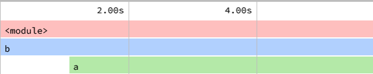
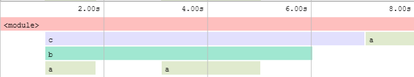
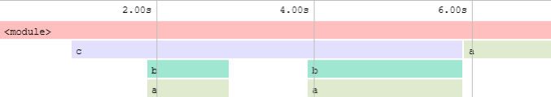
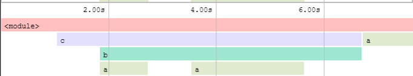
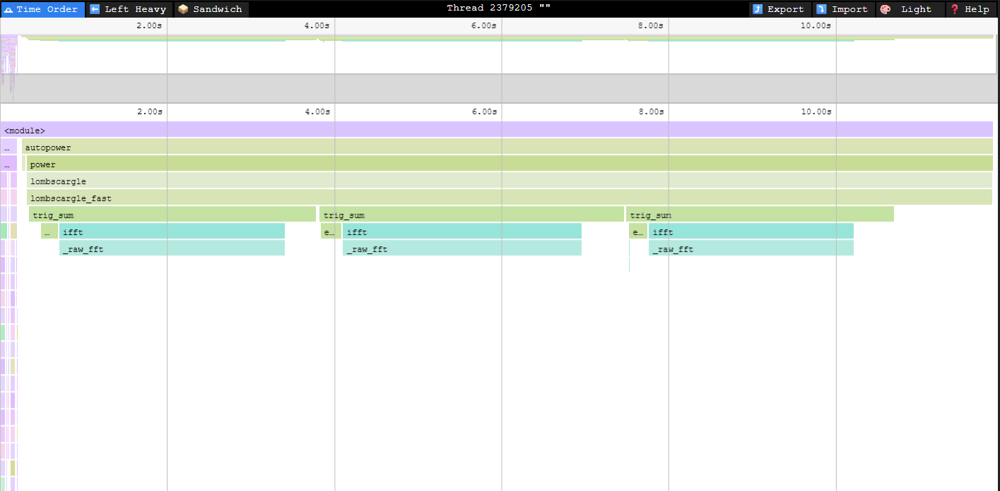
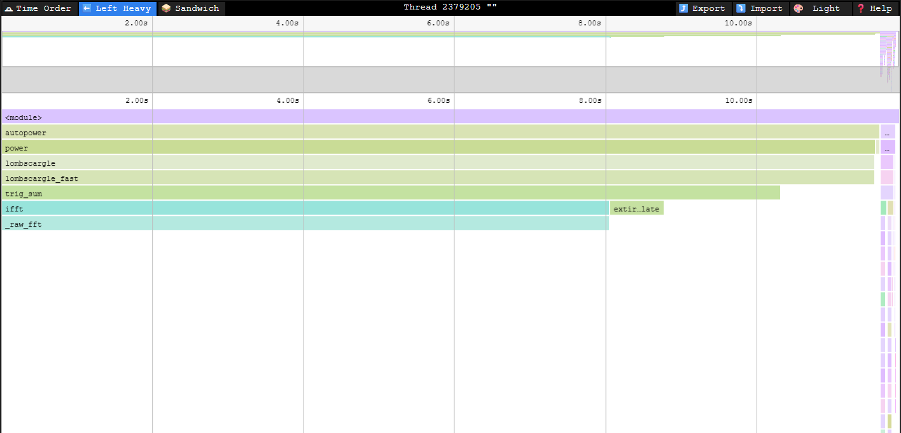
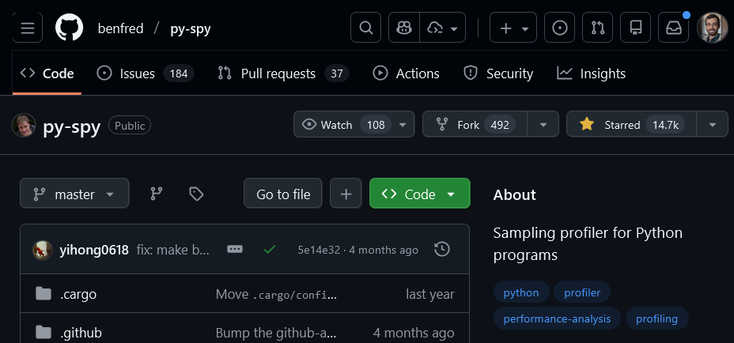

---
# You can also start simply with 'default'
theme: default
# background: https://cover.sli.dev
title: Python Profiling
# apply unocss classes to the current slide
class: text-center
# slide transition: https://sli.dev/guide/animations.html#slide-transitions
transition: slide-left
# enable MDC Syntax: https://sli.dev/features/mdc
mdc: true
lineNumbers: true
routerMode: hash
---

<style>
.katex {
  font-size: 1em; /* Adjust this value as needed */
}

.slidev-layout li {
  line-height: 1.4em; /* Adjust this value as needed */
}

.slidev-layout.cover h1 {
  font-size: 2.2em;
  font-weight: bold;
  margin-bottom: 0em;
}
</style>


# Python Profiling for Research Software
*CPU Profiling with py-spy, Speedscope, and more!*

<div class="authors-container">
  <div>
    Lehman Garrison<br>
    Senior Software Engineer<br>
    Scientific Computing Core (SCC)<br>
  </div>
</div>

<div>
Sciware #43 @ CCA<br>
December 16, 2025<br>
</div>

<br>

<div class="bottom-container">
  <div class="github-container">
    <a href="https://github.com/flatironinstitute/sciware/tree/main/43_CCAPythonProfiling" class="github-link" aria-label="GitHub Profile">
      
      flatironinstitute/sciware
    </a>
  </div>

  <div class="image-container">
    
  </div>

  <div class="image-container">
    
  </div>

</div>

<style>
  .authors-container {
    display: flex;
    justify-content: center;
    gap: 80px;
    margin: 20px 0;
  }

  .authors-container > div {
    flex: 0 1 auto;
  }

.bottom-container {
    display: flex;
    justify-content: center;
    align-items: center;
    gap: 50px;
    margin: 0 auto;
  }
  
  .image-container img {
    height: 50px;
  }

  .github-container {
    display: flex;
    align-items: center;
  }

  .github-link {
    display: flex;
    align-items: center;
    gap: 0px;
    text-decoration: none;
  }

  .github-icon {
    height: 40px;
    width: 40px;
    margin-right: 5px;
  }
</style>

---

## Sciware Rules of Engagement

### Goal:

Activities where participants all actively work to foster an environment which encourages participation across experience levels, coding language fluency, *technology choices*\*, and scientific disciplines.

<small>\*though sometimes we try to expand your options</small>

### Guidelines:

- Avoid discussions between a few people on a narrow topic
- Provide time for people who haven't spoken to speak/ask questions
- Provide time for experts to share wisdom and discuss
- Work together to make discussions accessible to novices

<small>
(These will always be a work in progress and will be updated, clarified, or expanded as needed.)
</small>

<div class="image-container" style="display:flex; justify-content:center;">
  
</div>

---

# Introduction to Python Profiling: Timers

- Profiling can be as simple as using timers


<div class="grid grid-cols-2 gap-2">
<div class="col-span-1">
<br>
<i>Common pattern</i>
```python
from time import time

tstart = time()
f()
tend = time()
print('Took {} seconds'.format(tend - tstart))
# Took 0.5001230239868164 seconds
```
<br>
</div>

<v-click>
<div class="col-span-1">
<br>
<i>Recommendation</i>
```python
from timeit import default_timer

t = -default_timer()
f()
t += default_timer()
print(f'{t=:8.4f}')
# t=  0.5002
```
<br>
</div>
</v-click>
</div>


- Be careful about warm-up effects and timing variations, especially for fast functions!
- In IPython (e.g. Jupyter Notebooks):
```python
%timeit f()
```
```{*}{lines: false}
500 ms ± 12.6 μs per loop (mean ± std. dev. of 7 runs, 1 loop each)
```

---
layout: two-cols-header
---

# Two Kinds of Profilers
::left::

### Tracing Profilers
- Deterministically record the runtime of every Python statement
- Sometimes called "instrumenting" profilers
- ✅ Pro: **deterministic** accounting of every statement and function call
- ⚠️ Cons: **slow**, high overhead; can give misleading results. Modifies the code being executed.

::right::

### Sampling Profilers
- Take frequent snapshots of the program state (the "call stack"), infer statistically where your program is spending time
- ✅ Pros: **low overhead**, unintrusive
- ⚠️ Cons: **can miss fast functions**, require high sampling rate, produce large outputs, invalid traces, noisy results
- Despite cons, sampling profilers are usually considered the more modern, reliable option

---

# The Python Profiling Landscape

| | **Tracing** | **Sampling** |
| ---: | :--- | :--- |
| **Built-in** |  [cProfile](https://docs.python.org/3/library/profile.html#module-cProfile) |  [Tachyon](https://docs.python.org/3.15/library/profiling.sampling.html) (3.15+) |
| **Third-Party** | [line_profiler](https://github.com/pyutils/line_profiler) | 🔬 [py-spy](https://github.com/benfred/py-spy)<br>🚴 [pyinstrument](https://github.com/joerick/pyinstrument)<br> [Austin](https://github.com/P403n1x87/austin) |

<br>

- Specialized profilers
  - [xprof](https://openxla.org/xprof)/[tensorboard](https://www.tensorflow.org/tensorboard): PyTorch, [JAX](https://docs.jax.dev/en/latest/profiling.html#xprof-tensorboard-profiling), & TensorFlow
  - [NVIDIA Nsight](https://developer.nvidia.com/nsight-systems): CUDA code
  - [memray](https://github.com/bloomberg/memray): Python memory usage
  - Linux [perf](https://perfwiki.github.io/main/): low-level sampling profiler for complied code, but [supported natively](https://docs.python.org/3/howto/perf_profiling.html) by Python 3.12+

---
layout: two-cols-header
---

<style>
.col-left {
  padding-right: 2ex;
}
</style>

# Introduction to py-spy
https://github.com/benfred/py-spy ([most starred](https://github.com/topics/profiling) Python profiler on GitHub)

::left::

- Sampling profiler for Python
- Written in Rust (simplifies Python compatibility)
- Can launch a Python program under the profiler, or attach to an existing process
- Can profile native extensions, e.g. NumPy, Cython, pybind11, etc
- Supports subprocesses/multiprocessing and multithreading
- Supports CLI output or writing a trace file, including Speedscope support
- ⚠️ Doesn't work reliably on Flatiron cluster nodes due to a Rocky 8 Linux kernel bug (workstations are fine). Will be fixed with Rocky 9.

::right::


<div class="text-sm italic opacity-60 text-right">
  from the py-spy readme
</div>
---
layout: two-cols-header
---

<style>
.col-left {
  flex: 1;
  min-width: 0;
}
.col-right {
  flex: 4;
  min-width: 0;
}
.col-right pre {
  overflow-x: auto;
}
</style>

# py-spy: Profiling A Dummy Program

<div class="grid grid-cols-3 gap-3">
<div class="col-span-1">

```python {*|4,7}{at:1}
from time import sleep

def a():
    sleep(5)

def b():
    sleep(1)
    a()

b()
```
</div>

<div class="col-span-2 overflow-x-auto">
``` {*|8,9}{at:1}
❯ py-spy top -i python dummy.py

Collecting samples from 'python dummy.py' (python v3.13.2)
Total Samples 599
GIL: 0.00%, Active: 0.00%, Threads: 1

  %Own   %Total  OwnTime  TotalTime  Function (filename)                                 
100.00% 100.00%    4.98s     4.98s   a (dummy.py)
  0.00% 100.00%    1.01s     5.99s   b (dummy.py)
  0.00% 100.00%   0.000s     5.99s   <module> (dummy.py)
```

</div>

<div class="col-span-3">

- We're using `py-spy -i` to count idle time, since our dummy program uses `sleep()`.
- Tips
  - Ignore `%Own` and `%Total`, they show the % of samples *since the last refresh* (i.e. 1 second).
  - Focus on `OwnTime` and `TotalTime`, which show aggregate results over the entire run.
  - Press `3` or `4` to sort by `OwnTime` or `TotalTime`
  - Press `l` while profiling to toggle grouping by line number or function
</div>

</div>

---

# py-spy Quiz: Which Program is Being Profiled?

<div class="grid grid-cols-3 gap-4">

  <!-- top row: three examples -->
  <div class="col-span-1">
  
```python {*|*}{at:1}
from time import sleep

def a():
    sleep(0.5)

def b():
    sleep(2)
    for _ in range(4):
        a()

b()
```

  </div>

  <div class="col-span-1">
  
```python {*|none}{at:1}
from time import sleep

def a():
    sleep(4)

def b():
    sleep(2)
    a()

b()
```

  </div>

  <div class="col-span-1">
  
```python {*|none}{at:1}
from time import sleep

def a():
    sleep(2)

def b():
    a()
    a()

b()
```

  </div>

  <!-- bottom row: profile output spanning all 3 columns -->
  <div class="col-span-3">
  
```text
Collecting samples from 'python dummy2.py' (python v3.13.2)
Total Samples 408
GIL: 0.00%, Active: 0.00%, Threads: 1

  %Own   %Total  OwnTime  TotalTime  Function (filename)                                                                  
  0.00% 100.00%    2.06s     4.08s   b (dummy2.py)
100.00% 100.00%    2.02s     2.02s   a (dummy2.py)
  0.00% 100.00%   0.000s     4.08s   <module> (dummy2.py)
```

  </div>

</div>

---
layout: two-cols-header
---

<style>
.col-left {
  flex: 1;
  min-width: 0;
}
.col-right {
  flex: 4;
  min-width: 0;
}
.col-right pre {
  overflow-x: auto;
}
</style>

# py-spy: Line Number Mode

<div class="grid grid-cols-3 gap-3">
<div class="col-span-1">

```python
from time import sleep

def a():
    sleep(0.5)

def b():
    for _ in range(2):
        a()
    a()
    a()
    a()
    a()

b()
```

- Line number mode is very useful, but can hide how much overall time a given function takes. Often, you will want to look at the profile with line numbers both on and off (press `l` to toggle).

</div>

<div class="col-span-2 overflow-x-auto">
<div class="text-sm">Default view:</div>
```
Collecting samples from 'python dummy3.py' (python v3.13.2)
Total Samples 287
GIL: 0.00%, Active: 0.00%, Threads: 1

  %Own   %Total  OwnTime  TotalTime  Function (filename)                                                                  
100.00% 100.00%    2.87s     2.87s   a (dummy3.py)
  0.00% 100.00%   0.000s     2.87s   <module> (dummy3.py)
  0.00% 100.00%   0.000s     2.87s   b (dummy3.py)
```

<v-click>
<div class="text-sm">Line number mode:</div>
```
Collecting samples from 'python dummy3.py' (python v3.13.2)
Total Samples 276
GIL: 0.00%, Active: 0.00%, Threads: 1

  %Own   %Total  OwnTime  TotalTime  Function (filename:line)                                                             
100.00% 100.00%    2.76s     2.76s   a (dummy3.py:4)
  0.00% 100.00%   0.000s    0.380s   b (dummy3.py:12)
  0.00%   0.00%   0.000s    0.450s   b (dummy3.py:9)
  0.00%   0.00%   0.000s    0.520s   b (dummy3.py:10)
  0.00%   0.00%   0.000s    0.490s   b (dummy3.py:11)
  0.00%   0.00%   0.000s    0.920s   b (dummy3.py:8)
  0.00% 100.00%   0.000s     2.76s   <module> (dummy3.py:14)
```
</v-click>

</div>
</div>

---
layout: two-cols-header
---

# Example: Astropy Lomb-Scargle

<div class="grid grid-cols-3 gap-3">
<div class="col-span-1">

```python
import numpy as np

from astropy.timeseries import (
    LombScargle,
)

rng = np.random.default_rng(
    seed=123
)
N = 10**6
t = rng.uniform(
    0, 100, size=N
)
y = rng.poisson(
    np.sin(50 * t) + 2, size=N
)

frequency, power = (
    LombScargle(
        t, y
    ).autopower()
)
```

</div>

<div class="col-span-2 overflow-x-auto">

```{*}{maxHeight:'400px',lines: false}
❯ uv run -p 3.13 --with astropy -- py-spy top -- python lombscargle.py

Collecting samples from 'python lombscargle.py' (python v3.13.2)
Total Samples 1100
GIL: 0.00%, Active: 100.00%, Threads: 1

  %Own   %Total  OwnTime  TotalTime  Function (filename)                                                                                                                         
  0.00%   0.00%    7.52s     7.52s   _raw_fft (numpy/fft/_pocketfft.py)
 36.00%  36.00%    1.44s     9.66s   trig_sum (astropy/timeseries/periodograms/lombscargle/implementations/utils.py)
 64.00% 100.00%   0.710s    10.37s   lombscargle_fast (astropy/timeseries/periodograms/lombscargle/implementations/fast_impl.py)
  0.00%   0.00%   0.690s    0.700s   extirpolate (astropy/timeseries/periodograms/lombscargle/implementations/utils.py)
  0.00%   0.00%   0.090s    0.090s   autofrequency (astropy/timeseries/periodograms/lombscargle/core.py)
  0.00%   0.00%   0.080s    0.080s   get_data (<frozen importlib._bootstrap_external>)
  0.00% 100.00%   0.080s    10.78s   <module> (lombscargle.py)
  0.00%   0.00%   0.020s    0.020s   realpath (<frozen posixpath>)
  0.00%   0.00%   0.010s    0.010s   <module> (astropy/io/ascii/ecsv.py)
  0.00%   0.00%   0.010s    0.030s   getmodule (inspect.py)
  0.00%   0.00%   0.010s    0.010s   _path_join (<frozen importlib._bootstrap_external>)
  0.00%   0.00%   0.010s    0.080s   <module> (astropy/units/__init__.py)
  0.00%   0.00%   0.010s    0.240s   _call_with_frames_removed (<frozen importlib._bootstrap>)
  0.00%   0.00%   0.010s    0.020s   __init__ (astropy/units/core.py)
  0.00%   0.00%   0.010s    0.010s   _fill_cache (<frozen importlib._bootstrap_external>)
  0.00%   0.00%   0.010s    0.010s   exists (<frozen genericpath>)
  0.00%   0.00%   0.010s    0.010s   match (re/_parser.py)
  0.00%   0.00%   0.010s    0.010s   ShapedLikeNDArray (astropy/utils/shapes.py)
  0.00%   0.00%   0.010s    0.010s   _wrapreduction (numpy/_core/fromnumeric.py)
  0.00%   0.00%   0.010s    0.010s   _expand_and_gather (astropy/units/core.py)
  0.00%   0.00%   0.010s    0.010s   add_enabled_units (astropy/units/core.py)
  0.00%   0.00%   0.010s    0.010s   _code (re/_compiler.py)
  0.00%   0.00%   0.010s    0.010s   <module> (astropy/io/ascii/ipac.py)
  0.00%   0.00%   0.000s    0.010s   <module> (pydoc.py)
```

</div>
</div>

---
layout: two-cols-header
---

# Example: Astropy Lomb-Scargle (2)

::left::

```python {*}{maxHeight:'400px'}
# utils.py
def trig_sum(t, h, df, N, f0=0, freq_factor=1, oversampling=5, use_fft=True, Mfft=4):
    # ...
    df *= freq_factor
    f0 *= freq_factor

    if df <= 0:
        raise ValueError("df must be positive")
    t, h = map(np.ravel, np.broadcast_arrays(t, h))

    if use_fft:
        Mfft = int(Mfft)
        if Mfft <= 0:
            raise ValueError("Mfft must be positive")

        # required size of fft is the power of 2 above the oversampling rate
        Nfft = bitceil(N * oversampling)
        t0 = t.min()

        if f0 > 0:
            h = h * np.exp(2j * np.pi * f0 * (t - t0))

        tnorm = ((t - t0) * Nfft * df) % Nfft
        grid = extirpolate(tnorm, h, Nfft, Mfft)

        fftgrid = np.fft.ifft(grid)[:N]
        if t0 != 0:
            f = f0 + df * np.arange(N)
            fftgrid *= np.exp(2j * np.pi * t0 * f)

        C = Nfft * fftgrid.real
        S = Nfft * fftgrid.imag
    else:
        f = f0 + df * np.arange(N)
        C = np.dot(h, np.cos(2 * np.pi * f * t[:, np.newaxis]))
        S = np.dot(h, np.sin(2 * np.pi * f * t[:, np.newaxis]))

    return S, C
```

::right::

```python {*}{maxHeight:'400px'}
# fast_impl.py
def lombscargle_fast(
    t,
    y,
    dy,
    f0,
    df,
    Nf,
    center_data=True,
    fit_mean=True,
    normalization="standard",
    use_fft=True,
    trig_sum_kwds=None,
):
    # ...
    if dy is None:
        dy = 1

    # Validate and setup input data
    t, y, dy = np.broadcast_arrays(t, y, dy)
    if t.ndim != 1:
        raise ValueError("t, y, dy should be one dimensional")

    # Validate and setup frequency grid
    if f0 < 0:
        raise ValueError("Frequencies must be positive")
    if df <= 0:
        raise ValueError("Frequency steps must be positive")
    if Nf <= 0:
        raise ValueError("Number of frequencies must be positive")

    w = dy**-2.0
    w /= w.sum()

    # Center the data. Even if we're fitting the offset,
    # this step makes the expressions below more succinct
    if center_data or fit_mean:
        y = y - np.dot(w, y)

    # set up arguments to trig_sum
    kwargs = dict.copy(trig_sum_kwds or {})
    kwargs.update(f0=f0, df=df, use_fft=use_fft, N=Nf)

    # ----------------------------------------------------------------------
    # 1. compute functions of the time-shift tau at each frequency
    Sh, Ch = trig_sum(t, w * y, **kwargs)
    S2, C2 = trig_sum(t, w, freq_factor=2, **kwargs)

    if fit_mean:
        S, C = trig_sum(t, w, **kwargs)
        tan_2omega_tau = (S2 - 2 * S * C) / (C2 - (C * C - S * S))
    else:
        tan_2omega_tau = S2 / C2

    # This is what we're computing below; the straightforward way is slower
    # and less stable, so we use trig identities instead
    #
    # omega_tau = 0.5 * np.arctan(tan_2omega_tau)
    # S2w, C2w = np.sin(2 * omega_tau), np.cos(2 * omega_tau)
    # Sw, Cw = np.sin(omega_tau), np.cos(omega_tau)

    S2w = tan_2omega_tau / np.sqrt(1 + tan_2omega_tau * tan_2omega_tau)
    C2w = 1 / np.sqrt(1 + tan_2omega_tau * tan_2omega_tau)
    Cw = np.sqrt(0.5) * np.sqrt(1 + C2w)
    Sw = np.sqrt(0.5) * np.sign(S2w) * np.sqrt(1 - C2w)

    # ----------------------------------------------------------------------
    # 2. Compute the periodogram, following Zechmeister & Kurster
    #    and using tricks from Press & Rybicki.
    YY = np.dot(w, y**2)
    YC = Ch * Cw + Sh * Sw
    YS = Sh * Cw - Ch * Sw
    CC = 0.5 * (1 + C2 * C2w + S2 * S2w)
    SS = 0.5 * (1 - C2 * C2w - S2 * S2w)

    if fit_mean:
        CC -= (C * Cw + S * Sw) ** 2
        SS -= (S * Cw - C * Sw) ** 2

    power = YC * YC / CC + YS * YS / SS

    if normalization == "standard":
        power /= YY
    elif normalization == "model":
        power /= YY - power
    elif normalization == "log":
        power = -np.log(1 - power / YY)
    elif normalization == "psd":
        power *= 0.5 * (dy**-2.0).sum()
    else:
        raise ValueError(f"normalization='{normalization}' not recognized")

    return power
```

---
layout: two-cols-header
---

# Flamegraphs: Dummy Program

<div class="grid grid-cols-3 gap-3">
<div class="col-span-1">

```python
from time import sleep

def a():
    sleep(5)

def b():
    sleep(1)
    a()

b()
```

</div>

<div class="col-span-2 overflow-x-auto">
<div style="display:flex; align-items:center; height:100%;">
  <div style="margin:0 auto; text-align:center;">
    
    <div class="text-sm italic opacity-60 text-right" style="margin-top:0.5rem;">
      Visualized with <a href="https://www.speedscope.app">https://www.speedscope.app</a>
    </div>
  </div>
</div>
</div>

</div>


::left::

- Flamegraphs are a profile visualization technique
  - *Time* on the x-axis
  - *Call stack* on the y-axis
- Long-running functions appear as wide bars
- Moving top to bottom, each row represents one level deeper in the call stack, i.e. a call into a child function
  - Sometimes called "icicle graphs" when displayed in this top-to-bottom order

::right::

- Time without any children is "self time"
- Time with children is "total time"
- To generate a flamegraph with py-spy, use:
  ```bash {*}{lines: false}
  py-spy record -F -f speedscope -- python your_program.py
  ```
    - `-F` makes the line numbers correspond to function definitions, not call sites. Useful for left-heavy mode.
- Open the resulting `json` file in [www.speedscope.app](https://www.speedscope.app), or use VS Code extension

---

# Flamegraphs: Quiz

<div class="grid grid-cols-3 gap-3">
<div class="col-span-1">
Which flamegraph does this program correspond to?

```python
from time import sleep

def a(i):
    sleep(i)

def b():
    for i in range(1,3):
        a(i)
        sleep(1)

def c():
    sleep(1)
    b()

sleep(1)
c()
a(1)
```

</div>
<div class="col-span-2" style="display:flex; flex-direction:column; align-items:center; gap:1rem;">
  
  
  
</div>
</div>

---
layout: center
---

<center>
<h1>Flamegraphs</h1>
<h2>🔬 Speedscope Demo with Lomb-Scargle</h2>
</center>
<br>
<div class="text-center opacity-60">
<a href="https://www.speedscope.app">https://www.speedscope.app</a>
</div>

---

# Flamegraphs: Astropy Lomb-Scargle



---

# Flamegraphs: Astropy Lomb-Scargle Left-Heavy



---
layout: two-cols-header
---

# Example: Astropy Lomb-Scargle Native Profile

```{*}{maxHeight:'400px',lines: false}
❯ uv run -p 3.13 --with astropy -- py-spy top -n -- python lombscargle.py

Collecting samples from 'python lombscargle.py' (python v3.13.2)
Total Samples 1100
GIL: 5.00%, Active: 100.00%, Threads: 1

  %Own   %Total  OwnTime  TotalTime  Function (filename)                                                                                                                         
  0.00%   0.00%    6.34s     6.34s   pocketfft::detail::cfftp<double>::pass_all<false, pocketfft::detail::cmplx<double> > (numpy/fft/_pocketfft_umath.cpython-313-x86_64-linux-gn
  0.00%   0.00%   0.750s     7.72s   wrap_legacy_cpp_ufunc<&fft_loop<double>(char**, long const*, long const*, void*)> (numpy/fft/_pocketfft_umath.cpython-313-x86_64-linux-gnu.s
  0.00%   0.00%   0.610s    0.610s   pocketfft::detail::cfftp<double>::cfftp (numpy/fft/_pocketfft_umath.cpython-313-x86_64-linux-gnu.so)
 27.00%  27.00%   0.470s    0.470s   DOUBLE_multiply_AVX2 (numpy/_core/_multiarray_umath.cpython-313-x86_64-linux-gnu.so)
 11.00%  11.00%   0.390s    0.390s   sincosf64 (libm-2.28.so)
  0.00%   0.00%   0.380s    0.380s   CDOUBLE_add_indexed (numpy/_core/_multiarray_umath.cpython-313-x86_64-linux-gnu.so)
  7.00%   7.00%   0.220s    0.220s   CDOUBLE_multiply_AVX2 (numpy/_core/_multiarray_umath.cpython-313-x86_64-linux-gnu.so)
  7.00%   7.00%   0.140s    0.140s   DOUBLE_add_AVX2 (numpy/_core/_multiarray_umath.cpython-313-x86_64-linux-gnu.so)
  8.00%   8.00%   0.120s    0.120s   DOUBLE_subtract_AVX2 (numpy/_core/_multiarray_umath.cpython-313-x86_64-linux-gnu.so)
  2.00%  19.00%   0.120s    0.660s   nc_exp (numpy/_core/_multiarray_umath.cpython-313-x86_64-linux-gnu.so)
 12.00%  12.00%   0.120s    0.120s   DOUBLE_divide_AVX2 (numpy/_core/_multiarray_umath.cpython-313-x86_64-linux-gnu.so)
  4.00%   4.00%   0.090s    0.090s   munmap (libc-2.28.so)
  0.00%   0.00%   0.080s    0.080s   CDOUBLE_divide (numpy/_core/_multiarray_umath.cpython-313-x86_64-linux-gnu.so)
  4.00%   4.00%   0.080s    0.080s   LONG_fill (numpy/_core/_multiarray_umath.cpython-313-x86_64-linux-gnu.so)
  0.00%   0.00%   0.080s    0.080s   _xstat (libc-2.28.so)
  3.00%   3.00%   0.080s    0.080s   _aligned_contig_cast_double_to_cdouble (numpy/_core/_multiarray_umath.cpython-313-x86_64-linux-gnu.so)
  5.00%   5.00%   0.050s    0.050s   DOUBLE_sqrt_SSE41 (numpy/_core/_multiarray_umath.cpython-313-x86_64-linux-gnu.so)
  2.00%   2.00%   0.050s    0.050s   _aligned_contig_cast_long_to_double (numpy/_core/_multiarray_umath.cpython-313-x86_64-linux-gnu.so)
  0.00%   0.00%   0.040s    0.040s   DOUBLE_remainder (numpy/_core/_multiarray_umath.cpython-313-x86_64-linux-gnu.so)
  0.00%   0.00%   0.030s    0.030s   npy_cexp (numpy/_core/_multiarray_umath.cpython-313-x86_64-linux-gnu.so)
  1.00%  17.00%   0.030s    0.510s   cexpf64 (libm-2.28.so)
  1.00%   1.00%   0.020s    0.020s   0x1554324fc25b (libm-2.28.so)
  0.00%   0.00%   0.020s    0.020s   open64 (libpthread-2.28.so)
  1.00%   1.00%   0.020s    0.020s   0x1554324fc35d (libm-2.28.so)
```

---

# py-spy Cheat Sheet

<div class="grid grid-cols-2 gap-2">

<div class="col-span-1">

### Installation

- Run as a one-off:
  ```bash {lines: false}
  uvx py-spy
  ```
- Or, install globally:
  ```bash {lines: false}
  uv tool install py-spy
  ```
- Or, install in a venv:
  ```bash {lines: false}
  pip install py-spy
  ```

</div>

<div class="col-span-1">


<div class="text-sm italic opacity-60 text-right" style="margin-top: 0em;">
<a href="https://github.com/benfred/py-spy/">https://github.com/benfred/py-spy/</a>
</div>

</div>
</div>

<div class="grid grid-cols-2 gap-2">
<div class="col-span-2">

### Commands
</div>
<div class="col-span-1">

- Run a program and save the profiling info to disk to analyze with Speedscope:
  ```bash {lines: false}
  py-spy record -F -f speedscope python prog.py
  ```
- Show a `top`-like TUI of the live profile. Press `l` to toggle line number mode:
  ```bash {lines: false}
  py-spy top python prog.py
  ```

</div>
<div class="col-span-1">

- Attach to a running process by PID:
  ```bash {lines: false}
  py-spy <top|record> -p <pid>
  ```
- Show native code in the profile with `-n`:
  ```bash {lines: false}
  py-spy <top|record> -n python prog.py
  ```
</div>
</div>

---
layout: section
---

# Tachyon
New Sampling Profiler in Python 3.15
<div class="flex justify-center">
  
</div>

---
layout: two-cols-header
---

# Tachyon
https://docs.python.org/3.15/library/profiling.sampling.html

::left::

- New sampling profiler in Python 3.15 (unreleased)
- Uses the new "remote debugging" capability (i.e. pdb attach to running process) added in Python 3.14
- Built into Python under the `profiling.sampling` module (PEP 799)
- Runs externally to the Python process (like py-spy)
- Written by CPython core developers, targeting a much higher default sampling rate (10 KHz - 1 MHz)
- As of a few days ago, has a live TUI

::right::

<SlidevVideo autoplay controls>
  <source src="./assets/tachyon-pablogsal.mp4" type="video/mp4" />
  <p>
    Your browser does not support videos. You may download it
    <a href="/myMovie.mp4">here</a>.
  </p>
</SlidevVideo>

<div class="text-sm italic opacity-60 text-right">
  via <a href=https://github.com/python/cpython/issues/141645>https://github.com/python/cpython/issues/141645</a> (@pablogsal)
</div>

---

# Tachyon Example

```{*}{maxHeight:'400px'}
❯ uv run -p 3.15 -m profiling.sampling dummy.py
Captured 60107 samples in 6.01 seconds
Sample rate: 10000.02 samples/sec
Error rate: 0.00%
Profile Stats:
       nsamples   sample%   tottime (s)    cumul%   cumtime (s)  filename:lineno(function)
        0/59988       0.0         0.000     100.0         5.999  dummy.py:10(<module>)
    50001/50001      83.4         5.000      83.4         5.000  dummy.py:4(a)
        0/50001       0.0         0.000      83.4         5.000  dummy.py:8(b)
      9987/9987      16.6         0.999      16.6         0.999  dummy.py:7(b)

Legend:
  nsamples: Direct/Cumulative samples (direct executing / on call stack)
  sample%: Percentage of total samples this function was directly executing
  tottime: Estimated total time spent directly in this function
  cumul%: Percentage of total samples when this function was on the call stack
  cumtime: Estimated cumulative time (including time in called functions)
  filename:lineno(function): Function location and name

Summary of Interesting Functions:

Functions with Highest Direct/Cumulative Ratio (Hot Spots):
  1.000 direct/cumulative ratio, 83.4% direct samples: dummy.py:(a)
  0.166 direct/cumulative ratio, 16.6% direct samples: dummy.py:(b)

Functions with Highest Call Frequency (Indirect Calls):
  59988 indirect calls, 100.0% total stack presence: dummy.py:(<module>)
  50001 indirect calls, 100.0% total stack presence: dummy.py:(b)

Functions with Highest Call Magnification (Cumulative/Direct):
  6.0x call magnification, 50001 indirect calls from 9987 direct: dummy.py:(b)
```

---

# Summary
- CPU profiling helps show you where your program is spending time
- The core concepts across profilers are "own time" and "total time"
  - *Own time:* time spent executing statements in this function
  - *Total time:* time spent executing this function or child functions
- py-spy and Speedscope are a powerful combo. Core commands:
  ```bash {lines: false}
  py-spy top python your_program.py
  py-spy record -F -f speedscope python your_program.py
  # open resulting json file in https://www.speedscope.app
  ```
- All these profiles display function name and file name. Consider this when naming your functions—does this name make sense in isolation?
- Tachyon is likely to become the go-to profiler in Python 3.15. Try it now with
  ```bash {lines: false}
  uv run -p 3.15 -m profiling.sampling
  ```

### Up Next
- These tools are generally not helpful with JIT-compiled Python code (e.g. JAX, PyTorch, Tensorflow, Numba)
- Specialized, framework-aware profilers usually required for those

---

<div class="text-center">
  <h1>Feedback Form</h1>
  Only 1 required question!
</div>

<div class="text-center">
<a href="https://bit.ly/48Hh33D">https://bit.ly/48Hh33D</a>
</div>
